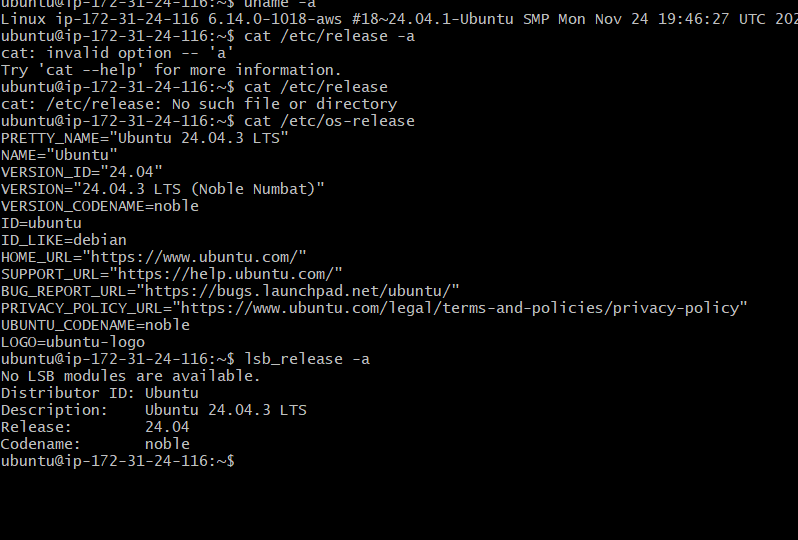
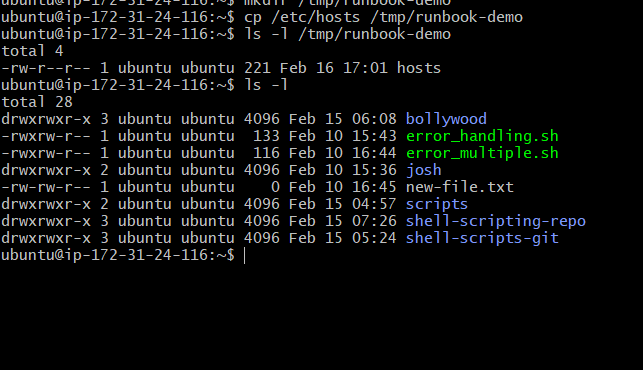
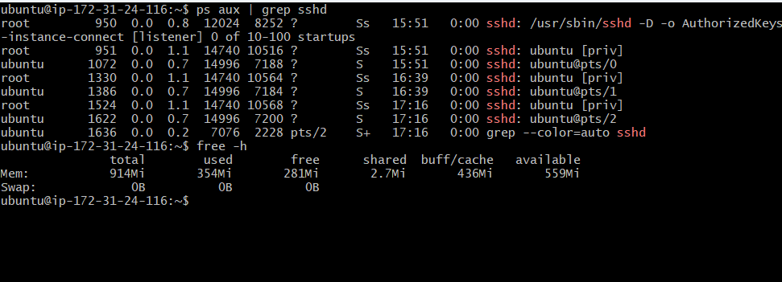
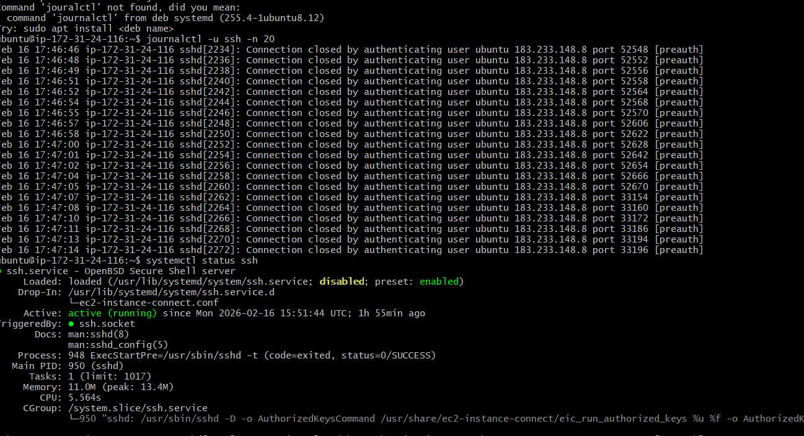

## Day 05 - Linux Troubleshooting Runbook (SSh Service)

# Target Service
  ssh

  - This runbook captures a basic Linux troubleshooting drill performed on an
AWS EC2 Ubuntu instance. The goal is to verify system health and ensure
the SSH service is running normally.

---

## Environment Check
 - commands
  uname -a
   - this will give you kernel level information 
  cat /etc/os-release
   - this will give you linux distribution details
  lsb_release -a 
    - os level infomation with formated way 
    ScreenShot :
    
## Filesystem Sanity check 
 commands:
  - mkdir /tmp/runbook-demo
    create a empty file to check the permission
  - cp /etc/hosts /tmp/runbook-demo
    copy data to file to check space and write also 
  - ls -l /tmp/runbook-demo
    to check the permission and file is correct
  ScreenShot:
  

## Cpu and Memory Check
 commands:
  - top : 
    to check the cpu usage and memory how much consume
  - ps aux | grep sshd
    verified SSH daemon process is running and checked its CPU usage.
  - free -h 
    memory usage is within normal limits and no memory pressure observed
 ScreenShot:
 

## Disk Usage
  commands:
  - df -h 
    check overall disk space uses
  - du -sh /var/log
    check the log folder size 
  - sudo du -sh /var/log/auth.log
    check the auth log file size 
 ScreenShot :
 

## SSH Logs Review
Command :
- journalctl -u ssh 20 
  check log of ssh last 20 lines review logs
ScrenShot:

## Quick findings
-  ssh service up and running 
- no critical error 
-  disk space and cpu healthy
## If this worsens
 - systemctl status ssh : check ssh staus active/inactive
 - restart ssh 
 - check logs and find error
 - verify authentication failures
 - verify securit group and firewwll