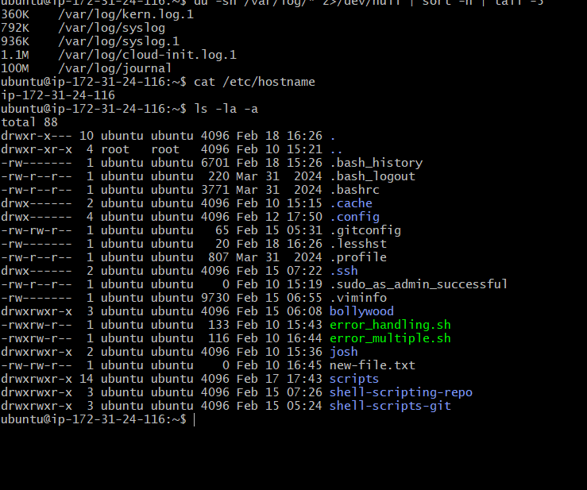

# Day 07 – Linux File System Hierarchy & Scenario-Based Practice

## Task
 Today's goal is to understand where things live in Linux and practice troubleshooting like a DevOps engineer.
 - You will create notes covering:

Linux File System Hierarchy (the most important directories)
Practice solving real-world scenarios step by step
This consolidates your Linux fundamentals and prepares you for real-world troubleshooting.

## Part 1 Linux File System 
 - In linux everything treated as file.
 - All files  are divided into 3 types.
 ###  Normal or Ordinary files:
      These files contains data either test files and binary files.
 ### Directory Files :
     These files represent directories.Directory can contain files and sub directories.
 ### Device Files :
     In linux every device is represented as a files.By using this device we can communicate with that device.
## Linux File System Hierarchy
  - It start with root 
  ### `(/) root`
   - / is the top most directory
   - Any other directory and file starts from here.
   - important directory like : bin,sbin,etc,dev,var,tmp,home...
 ### `bin`
   - bin means binary 
   - This directory contains all binary excutable related to our linux command.
   - bin contains binary file of command thats related to normal user
 ### `sbin`
   - sbin means systembin.
   - it contains all binary excutable related to high end admin commands like disk partition,n/w management,reboot,shutdown.
   - sbin contains binary file that related to super user.
 ### `etc`
   - This directory conatins all system configruation.These config can be used to customize behaviour of linux os.
   - all user info avilable in etc/passwd file.
   - all group info are available in etc/group.
   - Host info are available in etc/hosts file.
 ### `tmp`
   -  tmp means temproary.it contains all temproary file created in this current session.
   - if any file required for the current session create that file inside tmp.These file are       automatically deleted at the time of system shutdown.
 ### `dev`
   - dev means device.
   - device is also treated as file,every devices treated as file.
   - by using that file we can communicate with devices.
   - All device related file store into dev directory e.g tty - Terminal related, fd - floppy related
 ### `mnt` 
   - mnt means mounting.
   - we have to attach external file system file from pen drive,cd, hard disk.Then only we can use that external files.This attachment processing called mounting.
   - The files of manual mounting will placed inside mnt directory.
 ### `home`
   - As linux is multi user os, for every user a separate directroy will created to hold his specific data like video, image, documents.All these user directories will be stored inside home directory.
 ### `root`
   - its a home directory for super user.
   - root user home here
 ### `var`
  - var means varible data.
  - if any data which is keep on changing,such type data will be stored inside this directory.
  - logs file store inside var.
 ### `opt`
   - opt means optional
   - This directory contains all 3rd party software installation files.
## Hands-On command
- du -sh /var/log/* 2>/dev/null | sort -h | tail -5 cat  /etc/hostname  ls -la -a

