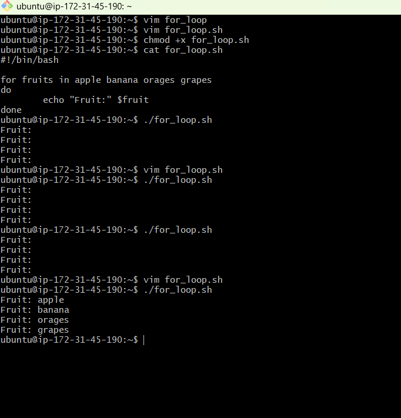
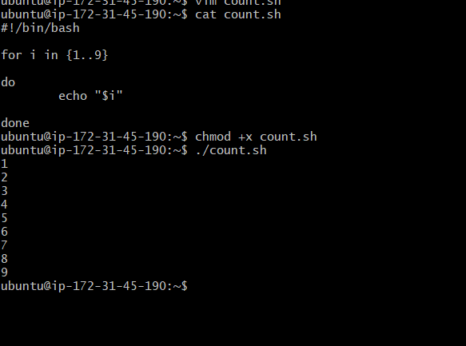
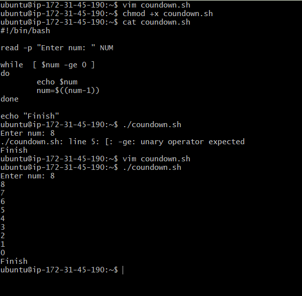
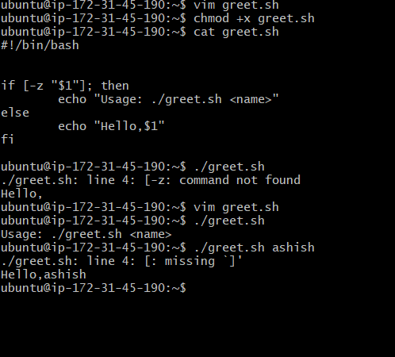
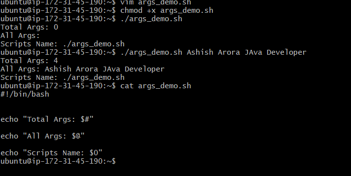
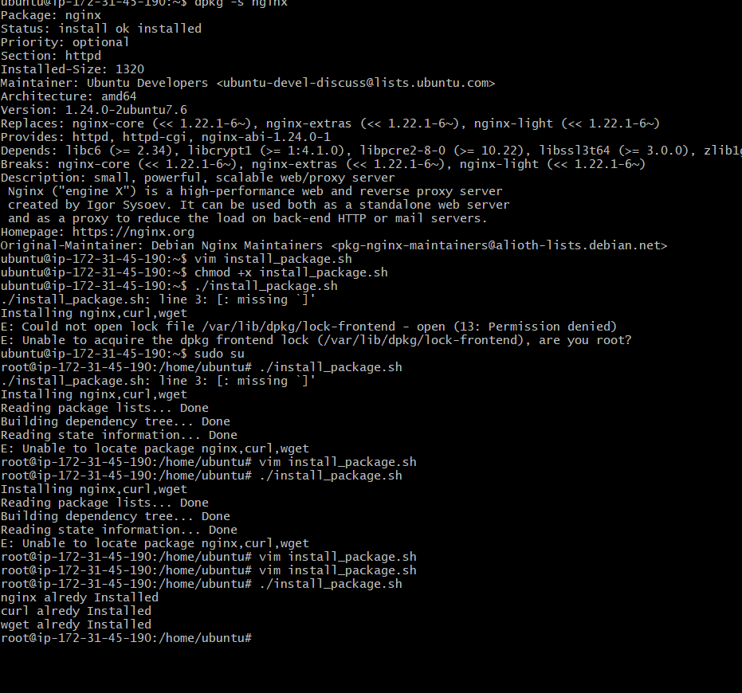

# Day 17 – Shell Scripting: Loops, Arguments & Error Handling
 ## Script Created
    - for_loop
     
    - count.sh
     
    - countdown
     
    - greet 
     
     - args
     
     - install_packages
     

    

