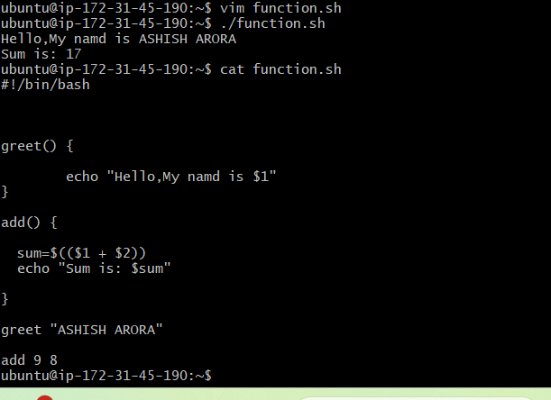
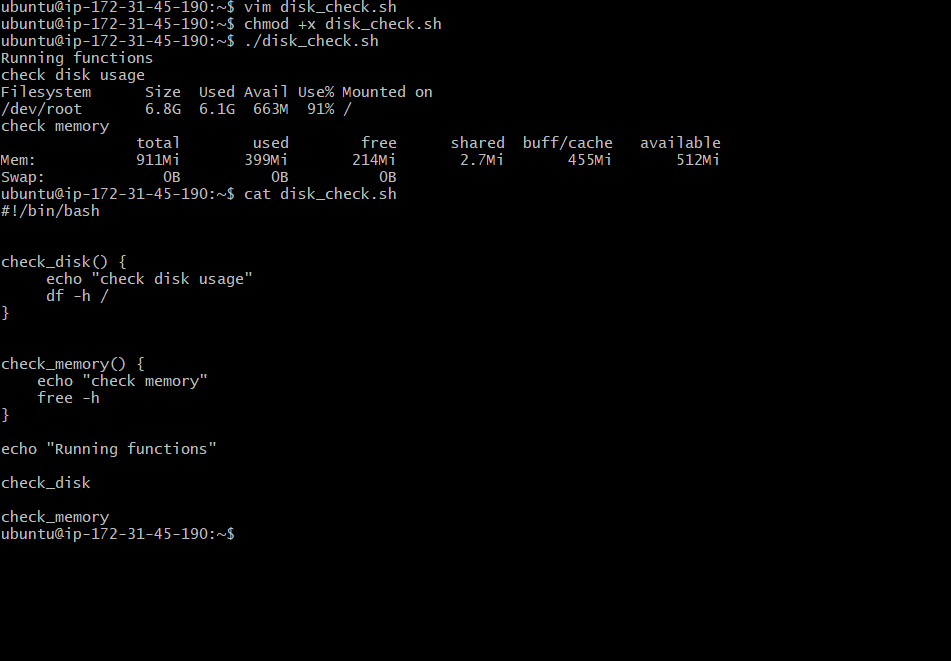
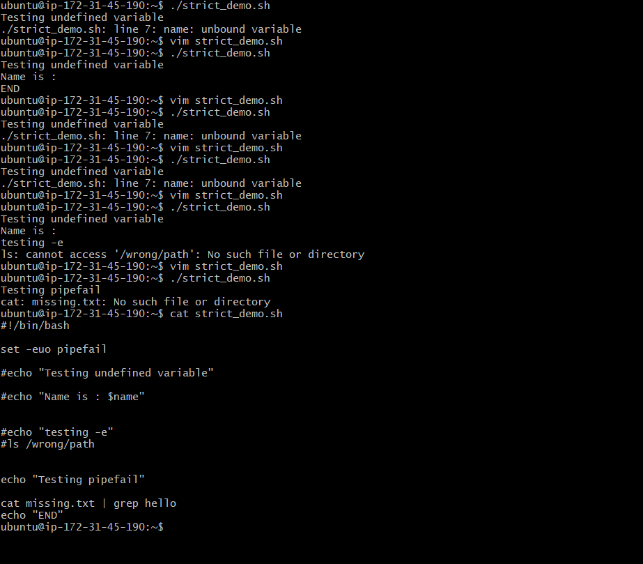
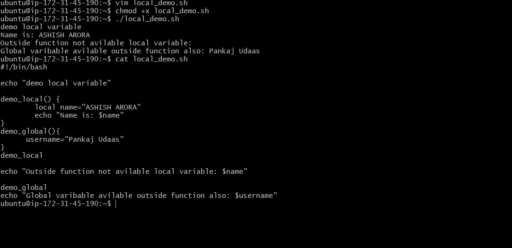
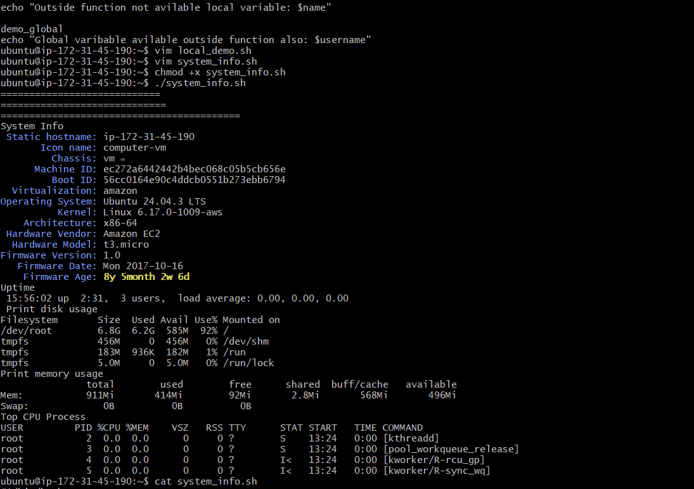

# Day 18 - Shell Scripting: Functions & Intermediate Concepts

## Functions Scripts

### Functions help in reusable 
  
### Disk Check Script
  
### Strict Mode
  
   - set -e → Exit if command fails
   - set -u → Exit if undefined variable used
   - set -o pipefail → Pipeline fails if any command fails
### Local vs Global
   - local: are acees inside function can`t access aoutside
   - global: are accessible from everywhere
   
### System -info
 - Commands used:

  - df -h
  - free -h
  - ps aux

  
