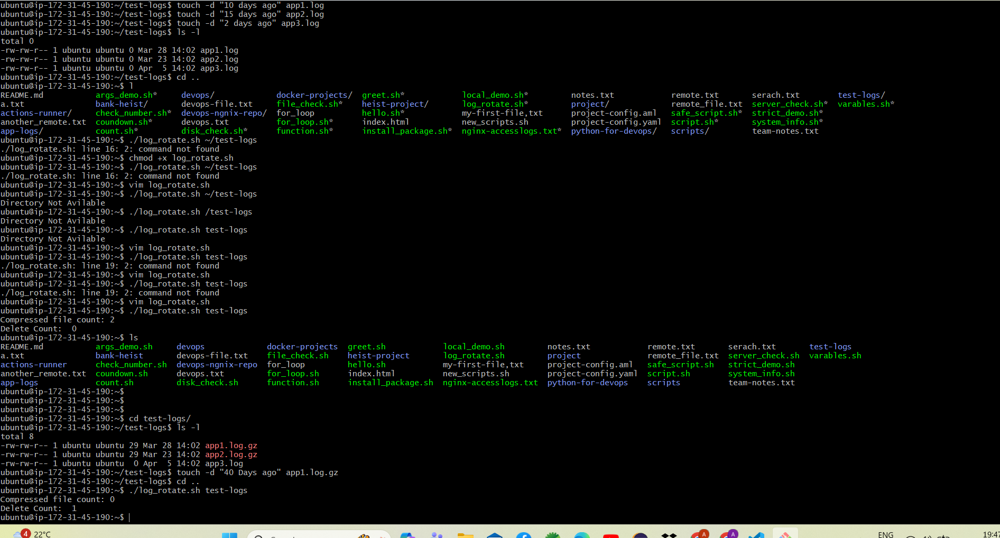
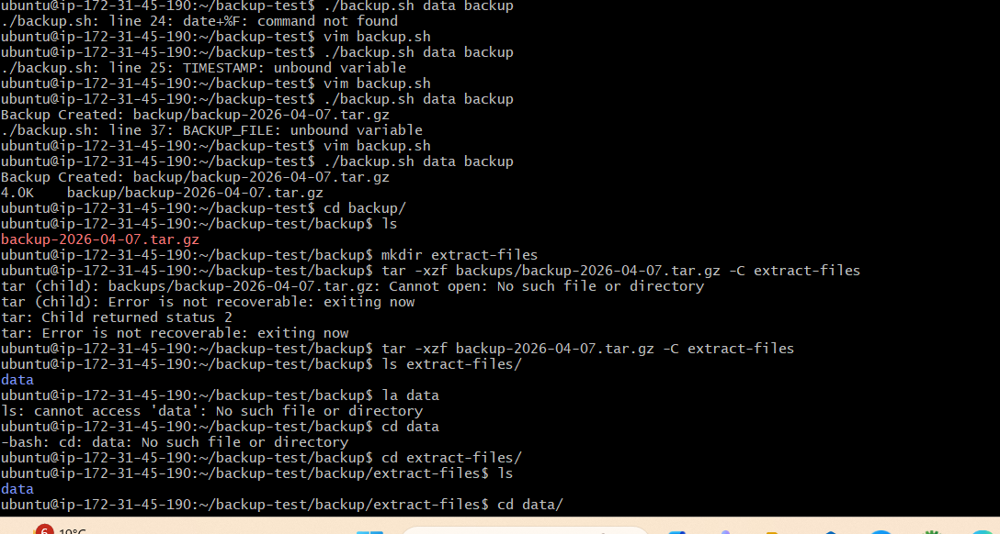

# Day 19 – Shell Scripting Project: Log Rotation, Backup, health checkup & Crontab
###  Log Rotation Script – log_rotate.sh
    
- Compresses .log files older than 7 days
- Deletes .gz archives older than 30 days
- Validates directory existence before execution
- Uses safe bash options (set -euo pipefail)
  

### Server Backup Script
 - Creates timestamped .tar.gz backups
- Validates source directory before running
- Automatically removes backups older than 14 days

