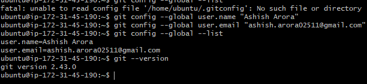
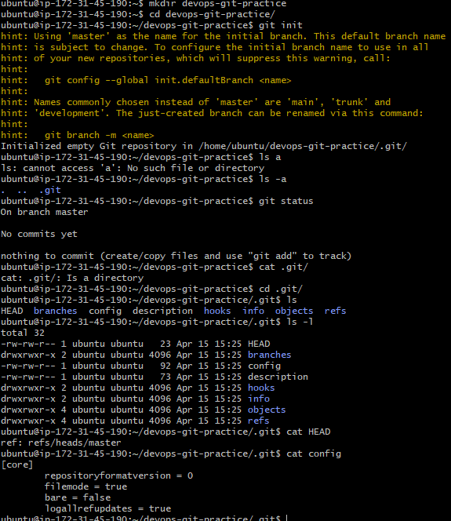
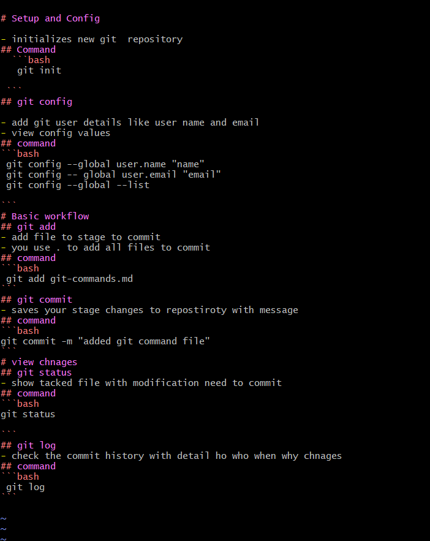
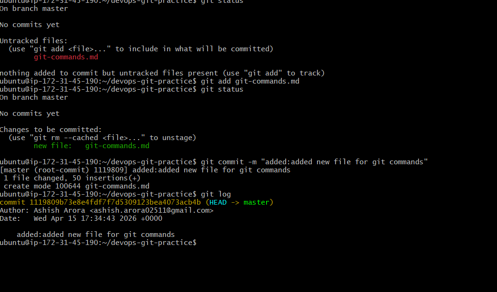
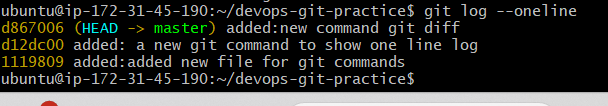

# Introduction to Git: Your First Repository


## Task 1
 1. Verify Git is installed on your machine
 2. Set up your Git identity — name and email
 3. Verify your configuration
### Commands:
  - git --version: to check the git version
  - git config --global user.name "": to set the username
  - git config --global user.email "": to set email
  - git config --global --list: to show your global info



## Task 2
 1. Create a new folder called `devops-git-practice`
 2. Initialize it as a Git repository
 3. Check the status — read and understand what Git is telling you
 4. Explore the hidden `.git/` directory — look at what's inside 

### commands:
 - mkdir : to make directory with name `devops-git-practice`
 - git init: Initialize it as a Git repository
 - git status: to check the current status
 

## Task 3
 # Setup and Config

  - initializes new git  repository
  ## Command
   ```bash
     git init
   ```
   ## git config

  - add git user details like user name and email
- view config values
## command
```bash
 git config --global user.name "name"
 git config -- global user.email "email"
 git config --global --list

```
# Basic workflow
## git add
- add file to stage to commit
- you use . to add all files to commit
## command
```bash
 git add git-commands.md
```
## git commit
- saves your stage changes to repostiroty with message
## command
```bash
git commit -m "added git command file"
```
# view chnages
## git status
- show tacked file with modification need to commit
## command
```bash
git status

```
## git log
- check the commit history with detail ho who when why chnages
## command
```bash
 git log
```

# Task 4
- stages my file with this command
 ```bash
  git add git-command.md
 ```
 - check status
 ```bash
 git status
 ```
- commit file with this command
```bash
 git commit -m "added: new file for git git command"
```
- check git history
```bash
 git log
```


# Task 5
- added more commit


# Task 6


