# Day 24 – Advanced Git: Merge, Rebase, Stash & Cherry Pick
You know how to branch and push to GitHub. Now it's time to learn how branches come back together — and what to do when you're in the middle of something and need to context-switch. These are the Git skills that separate beginners from confident practitioners.

### Task 1: Git Merge — Hands-On
- Create a new branch feature-login from main, add a couple of commits to it
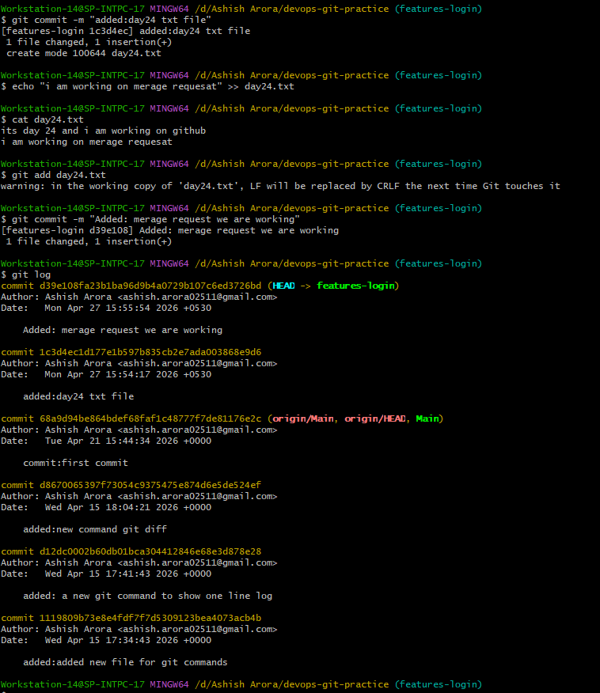
- Switch back to main and merge feature-login into main.
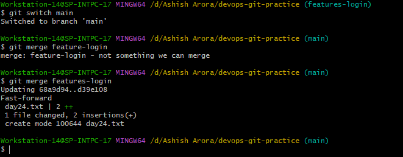
- Observe the merge — did Git do a fast-forward merge or a merge commit?
- do the fast-forward beacuse we are not chnaging in main branch .
- Now create another branch feature-signup, add commits to it — but also add a commit to main before merging
- 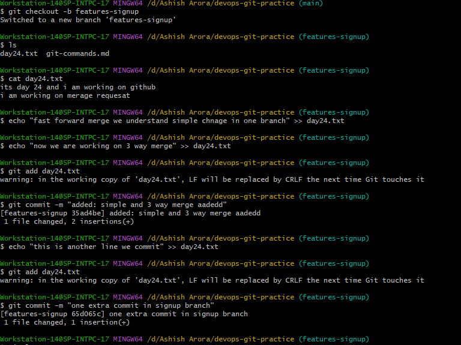
- Merge feature-signup into main — what happens this time?
- 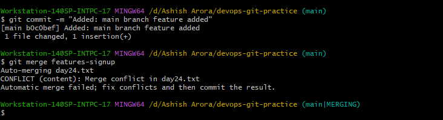
- Showing conflict of two branches.
- 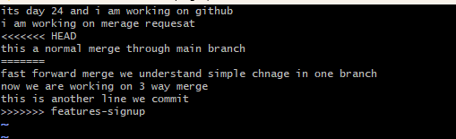
- Resolved conflict & Showing git merge log
-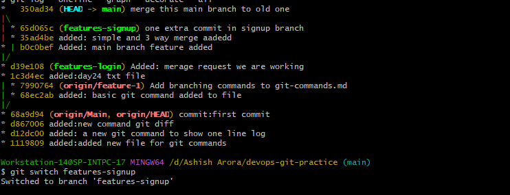

### Task 2: Git Rebase — Hands-On
- create new branch to test rebase and some commits to `feature-login`
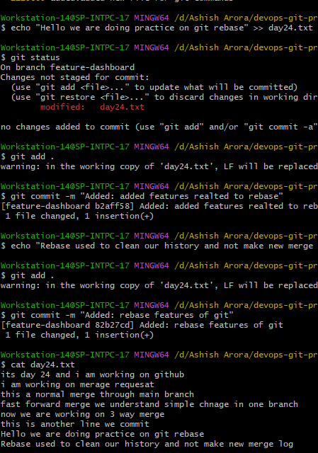
- Also added commit to main branch
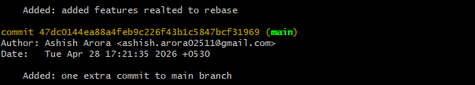
- Git Rebase Main branch to feature-login
- Conflict occur reslove it and rebase continue for commit chnages
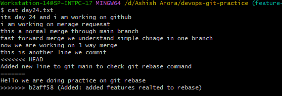
- Git rebase graph
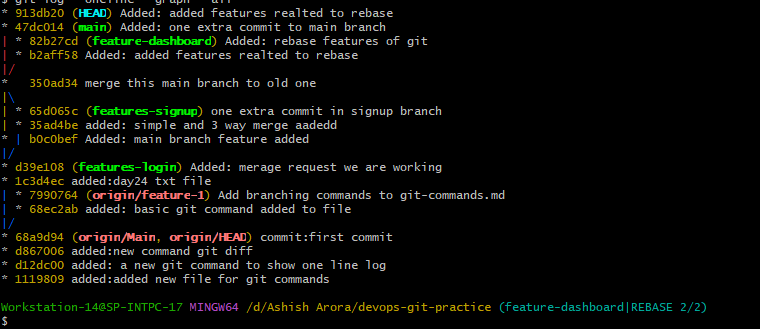

### Task 3: Squash Commit vs Merge Commit
- Create a branch feature-profile, add 4-5 small commits (typo fix, formatting, etc.)
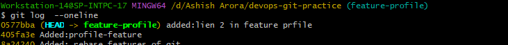
- Merge it into main using --squash — what happens?
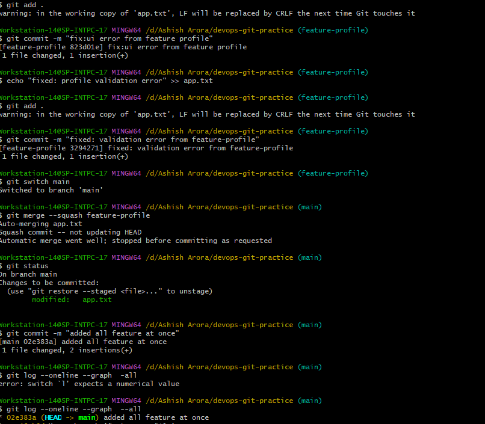
- Check git log — how many commits were added to main?
  - Exactly one commit was added to the main branch
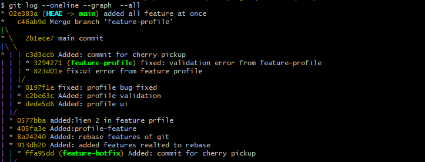
- Now create another branch feature-settings, add a few commits
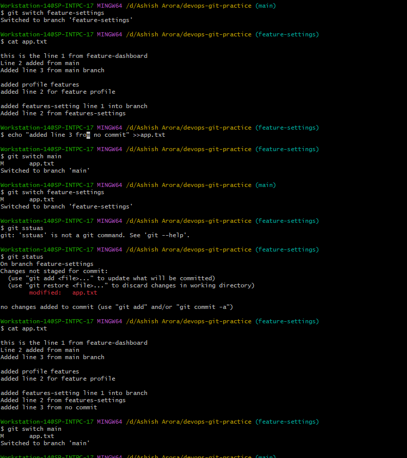
- Merge it into main without --squash (regular merge) — compare the history
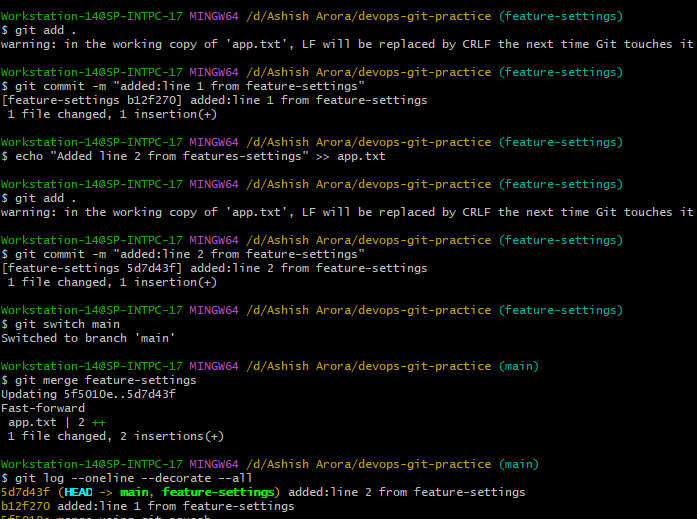

### Task 4: Git Stash — Hands-On
- Start making changes to a file but do not commit
- Now imagine you need to urgently switch to another branch — try switching. What happens?
  - If there is no conflict,git allows the switch and your changes move with you.
  - If there is a conflict,git blocks the switch to prevent overwriting your changes.
  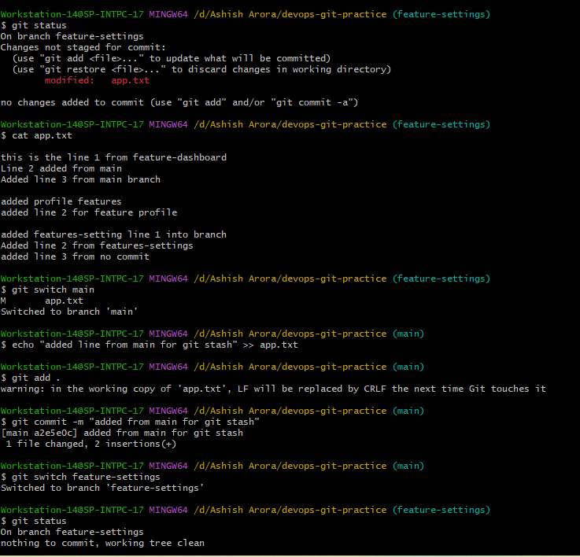
- Use git stash to save your work-in-progress
- Switch to another branch, do some work, switch back
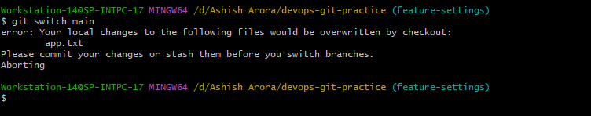
- Apply your stashed changes using git stash pop
- Try stashing multiple times and list all stashes
- Try applying a specific stash from the list
### Task 5: Cherry Picking
- Create a branch feature-hotfix, make 3 commits with different changes
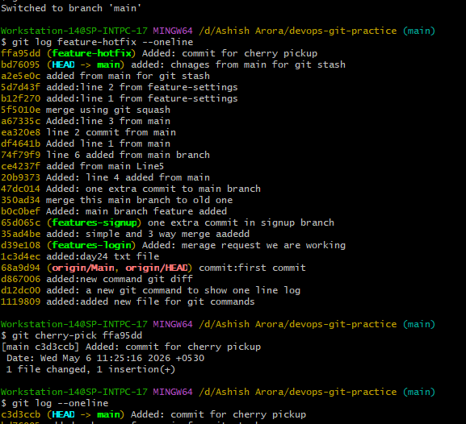
- Cherry-pick only the commit from feature-hotfix onto main
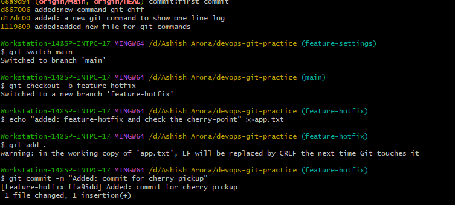
- Verify with git log that only that one commit was applied
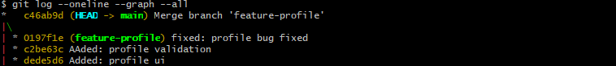

### Answer in your notes
  # What is a fast-forward merge?
   - A fast-forward merge happens when:`main branch has no new commits`and Git can simply move the branch pointer forward.No merge commit is created.
  # When does Git create a merge commit instead?
   - Git creates a merge commit when branches have diverged. `Both branches have their own commits`.
  # What is a merge conflict?
  - A merge conflict happens when:`Both branches changed the SAME part of the SAME file and Git cannot decide which change to keep.`
  # What does rebase actually do to your commits?
   - Takes your commits and replays them on top of another branch.
   - temporarily removes your commits
   - moves branch to latest base
   - reapplies your commits one-by-one
   - This is why:
    - commit IDs change
    - history becomes linear
  # How is the history different from a merge?
   - mergepreserves history exactly as it happened.creates a merge commit.
   - rebaserewrites history.moves your commits on top of feature-dashboard branch,creates a linear,clean history.no merge commit.
  # Why should you never rebase commits that have been pushed and shared with others?
  - because rebase changes commit id's,if others pulled the old commits:their history won’t match yours anymore causes conflicts,duplicated commits.
  # When would you use rebase vs merge?
  - rebase: keeping history linear
  - merge: working on shared branches.you want full history preserved.
  # What does squash merging do?
  - Combines multiple commits from a branch into ONE single commit before merging.
  # When would you use squash merge vs regular merge?
   - Do you want clean history OR complete history?
   - squash merge: Feature branch has many commits.You want clean main branch history.
   - regular merge: You want to preserve full commit history.

  # What is the trade-off of squashing?
  - The trade-off of squashing is that while it keeps the main branch history clean and linear,it removes the detailed commit history of the feature branch by combining everything into a single commit.
  # What is the difference between git stash pop and git stash apply?
  - git stash apply:Restores stash BUT keeps stash entry
  - git stash pop:Restores stash AND removes stash entry
  # When would you use stash in a real-world workflow?
  - You have unfinished/uncommitted work, but suddenly need to switch context safely.
  # What does cherry-pick do?
  Copy a specific commit from one branch and apply it to another branch.
  # When would you use cherry-pick in a real project?
  - You need ONLY specific commits from another branch, not the whole branch.
  # What can go wrong with cherry-picking?
   - merge conflicts if same file was modified.
   - Commit history confusion because it creates new commit ids.

