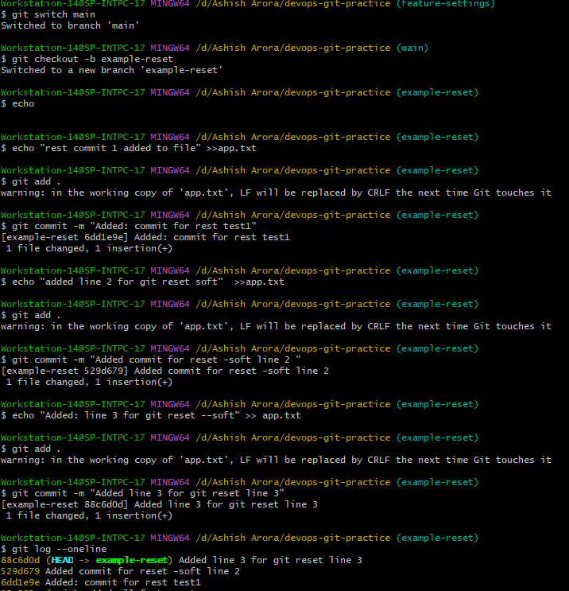
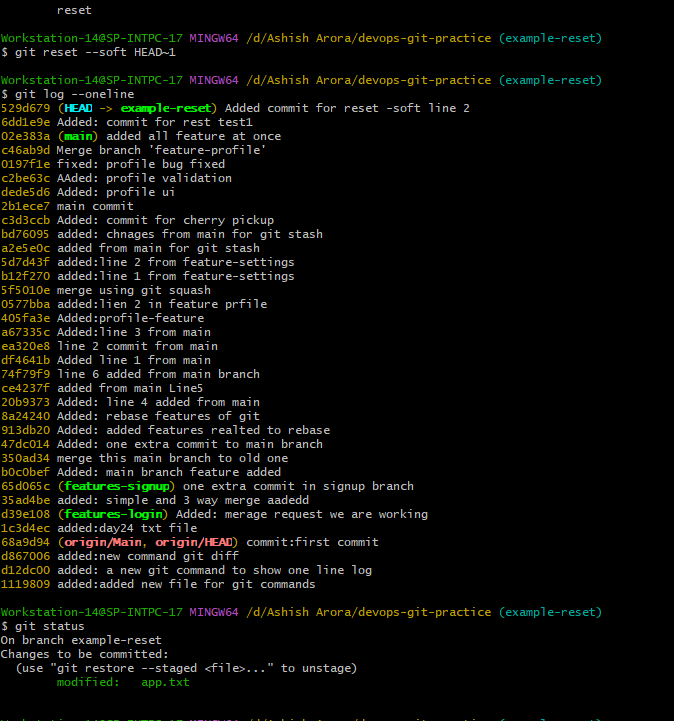
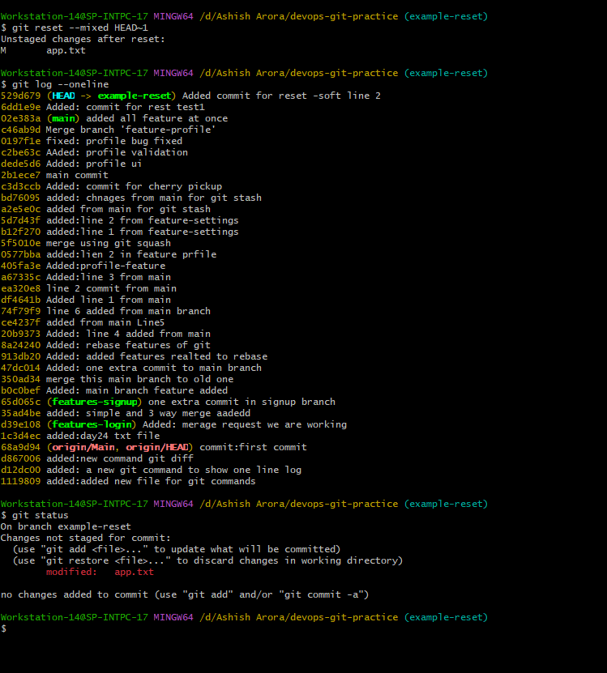
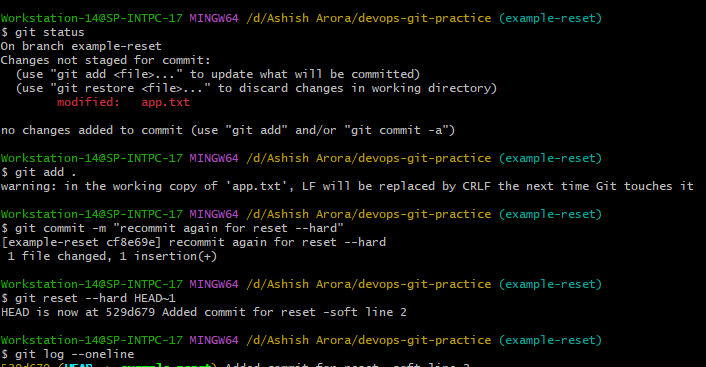
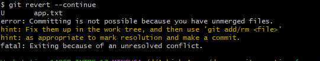
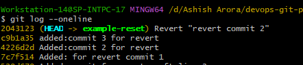

## Task
  Today task to learn  **undo mistakes**  safely — one of the most important skills in Git.


### Task 1: Git Reset — Hands-On
-  Make 3 commits in your practice repo (commit A, B, C)

- Use git reset --soft to go back one commit — what happens to the changes?
   - you see in git log it remove the latest commit 
   - but changes stayed in staged
   - you can agian commit if you want.
- 
- Re-commit, then use git reset --mixed to go back one commit — what happens now?
 - Git removes:
       - commit
       - staging
 - BUT keeps:
   - file changes
- 
- Re-commit, then use git reset --hard to go back one commit — what happens this time?
- 
### Answer notes:
 - What is the difference between --soft, --mixed, and --hard?
    -  --soft : Keep everything except commit
    -  --mixed: Keep only file changes
    - --hard: Delete everything
 -  Which one is destructive and why?
   - --hard is destructive because it permanently discards all uncommitted changes in your staging area and working directory.
 - When would you use each one?
   -   --soft : when you want to undo a commit but keep changes staged,for example to edit the commit message.
   -   --mixed: when you want to undo a commit and unstage changes,so you can modify them before recommitting.
   -   --reset: when you want to completely remove commits and all changes.
 - Should you ever use git reset on commits that are already pushed?
     - No,once commits are pushed,others may have already pulled and worked on them,so resetting them can cause confusion and conflicts.
### Task 2: Git Revert Hands-on
 - how git revert works
 - why revert is safer than reset
 - how revert conflicts happen
 
 - manual conflict resolution

### Answer notes:
 - How is `git revert` different from `git reset`?
  - `git revert`: Creates a new commit to undo changes.Preserves commit history
  - `git reset`: Moves HEAD backward and removes commits.Rewrites commit history
 - Why is revert considered safer than reset for shared branches?
  - it does not rewrite history, existing commits remain unchanged ,commit hashes stay same teammates are not affected.
 -  When would you use revert vs reset?
   - when commits are already pushed,on shared/team branches,when safe undo is needed.
   - for local cleanup,before pushing commits,when removing unwanted local commits.
### Task 3: Reset vs Revert — Summary
Create a comparison in your notes:

| | `git reset` | `git revert` |
|---|---|---|
| What it does | Create new commits and undo chnages | Move HEAD backward and remove commits from history |
| Removes commit from history? | YES | NO|
| Safe for shared/pushed branches? | NO | YES |
| When to use | When you rewrite history and remove commits| On branches that are already pushed/shared.To undo a commit without breaking history |
### Task 4: Branching Strategies
1. GitFlow:
  - main: production code
  - develop: The integration branch where new features are merged before they’re ready to go live.
  - feature: for added new functionality.
  - release: Used to prep a new version for production.Created from develop and merged into both main and develop.
  - hotfix:For urgent fixes on production.Created from main,then merged back into both main and develop.
  - Text diagram:
   ```text
    [main] (Production-ready)
    |
    o <----------------------------------------- (Start)
    | \
    |  \ [develop] (Integration)
    |   |
    |   o <------------------------------------- (Develop Start)
    |   | \
    |   |  \ [feature/login] (New functionality)
    |   |   |
    |   |   o (Feature Commit)
    |   |   |
    |   |   o (Feature Complete)
    |   |  /
    |   o / (Merge feature to develop)
    |   |
    |   | \
    |   |  \ [release/1.0] (Prep for production)
    |   |   |
    |   |   o (Release Prep/Bug Fix)
    |   |   |
    |   |   o (Release Ready)
    |   |  / \
    |   o /   o (Merge release to develop)
    |  /
    o / (Merge release to main & tag v1.0)
    |
    | \
    |  \ [hotfix/1.0.1] (Urgent fix)
    |   |
    |   o (Apply Fix)
    |  / \
    o /   o (Merge hotfix to develop)
    |
    V
    ```

2. **GitHub Flow**

    **How it works:**

    - Create a `feature branch` from `main`
    - Push commits to the `feature branch`
    - Open a pull request for code review and automated tests.
    - Once approved, merge back to `main`.
    - Deploy immediately.
    - Everything in main should always be production-ready.

    **Text Diagram:**
    ```text  
   
      [main] (Always Production-Ready)
        |
        o (Start)
        |
        |\_ _ _ _ _ _ _ _ _ _ _ _ _ _ _ 
        |                               \
        |                                \ [feature/login]
        |                                 |
        |                                 o (Commit 1)
        |                                 |
        |                                 o (Commit 2)
        |                                 |
        |                                 o (Pull Request & Review)
        |<_ _ _ _ _ _ _ _ _ _ _ _ _ _ _ _/
        |                               
        o (Merge & Auto-Deploy)
        |
        v
    ```

    **When/where it's used:**
    - ship frequent,small releases

     **Pros:**
    - Fast merge & deploy
    
     **Cons:**
     - In large teams,it can result in frequent merge conflicts

3. **Trunk-Based Development**

    **How it works:**

    - There’s one `main` branch, often called main or trunk. All development happens here
    - Developers commit directly to `main`, often multiple times per day
    - Changes are small,incremental

     **Text Diagram:**
     ```text
      [main] (The Trunk)
        |
        o (Start)
        |
        |\_ _ _ _ _ _ _ 
        |             \
        |              o (Dev A: Small Change)
        |<_ _ _ _ _ _ /
        |             /
        o (Merge & Test)
        |
        |\_ _ _ _ _ _ _ 
        |             \
        |              o (Dev B: Small Change)
        |<_ _ _ _ _ _ /
        |             /
        o (Merge & Test)
        |
        v
    ```

    **When/where it's used:**
    - building SaaS products or anything that updates frequently


    **Pros:**
    - Delivers the fastest feedback from dev to prod

    **Cons:**
    - Can be risky without tests

4. Answer:

   - Which strategy would you use for a startup shipping fast?
        - Trunk-Based Development
        
   - Which strategy would you use for a large team with scheduled releases?

        - GitFlow

   - Which one does your favorite open-source project use?

        - https://github.com/aws-containers/retail-store-sample-app.git (GitHub Flow)
