# Day 26 – GitHub CLI: Manage GitHub from Your Terminal

### Task 1: Install and Authenticate
1. Install the GitHub CLI on your machine
2. Authenticate with your GitHub account
3. Verify you're logged in and check which account is active
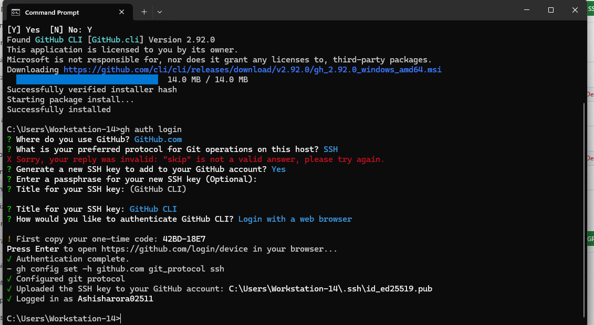

4. Answer in your notes: What authentication methods does `gh` support?
    - Browser-based OAuth
    - Personal Access Token (PAT)
    - SSH Key-based
---

### Task 2: Working with Repositories
1. Create a **new GitHub repo ** directrly from the terminal - make it public.
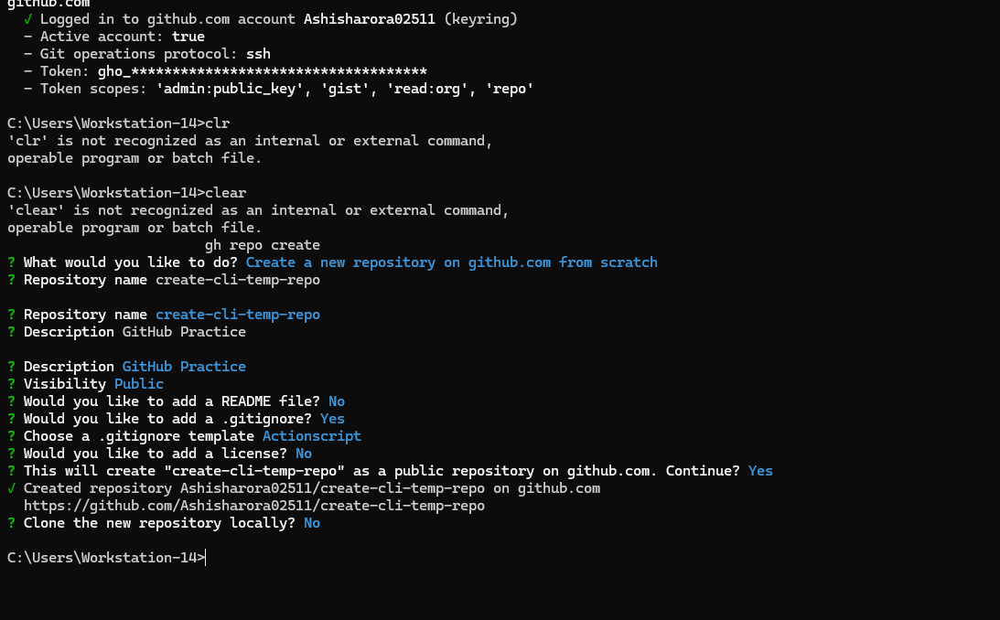
2. Clone a repo using `gh` instead of `git clone`
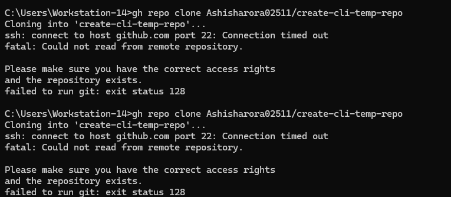
3. List all your repositories
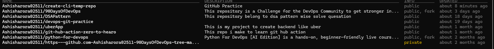
4. Open a repo in your browser directly from the terminal
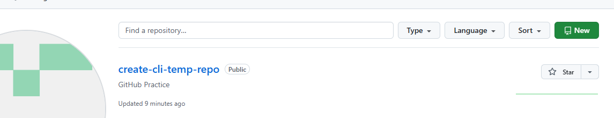


### Task 3: Create Issues
1. create a issue for your repo from terminal.
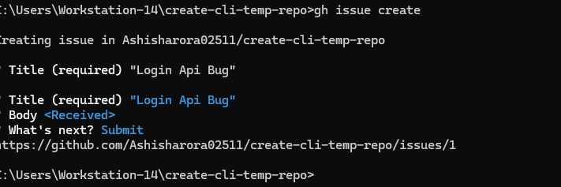
2. List all open issues on that repo list.
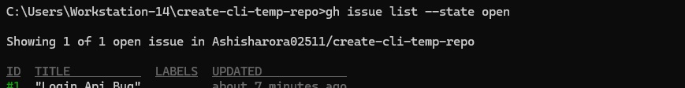
3. Close an issue from terminal.
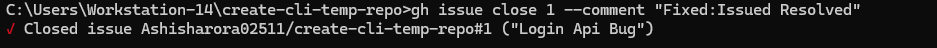
4. Answer in your notes: How could you use `gh issue` in a script or automation?
    - By combining gh issue commands in a script,you can automatically:
        - Check open issues
        - Add comments
        - Close issues

    - Example:
        ```bash
        gh issue list --repo srdangat/gh-cli-task-day26
        gh issue comment 1 --repo srdangat/gh-cli-task-day26 --body "Checked automatically."
        gh issue close 1 --repo srdangat/gh-cli-task-day26
        ```

---
### Task 4: Pull Requests
1. Create a branch, make a change, push it, and create a pull request entirely from the terminal
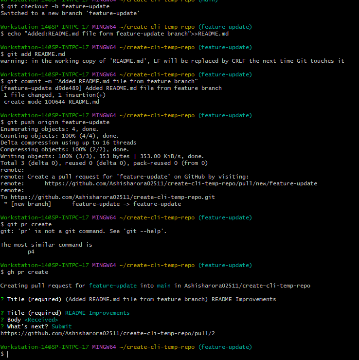
2. List all pr request.
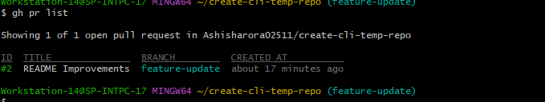
3. Merged pr rquest.
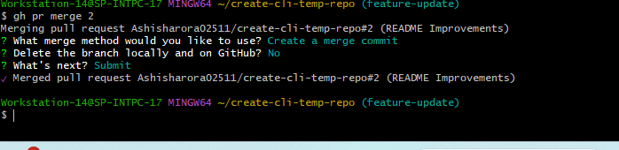
5. Answer in your notes:

   - What merge methods does `gh pr merge` support?

    - Merge Commit
    - Squash and Merge
    - Rebase and Merge

   - How would you review someone else's PR using `gh`?
    - `gh pr review <PR-number>`
    - `gh pr diff 2`
    - `gh pr checkout 2`
---

### Task 5: GitHub Actions & Workflows (Preview)
1. List the workflow runs on any public repo that uses GitHub Actions
2. View the status of a specific workflow run.
