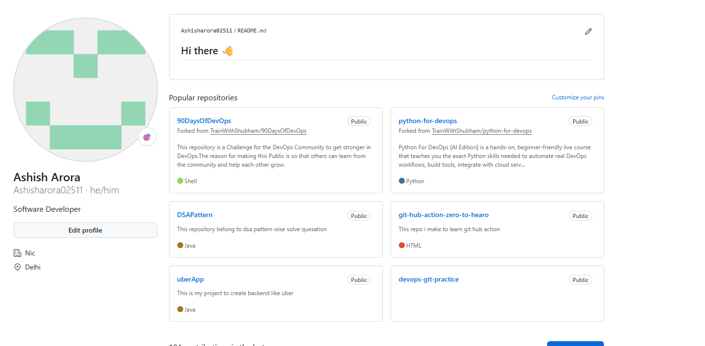
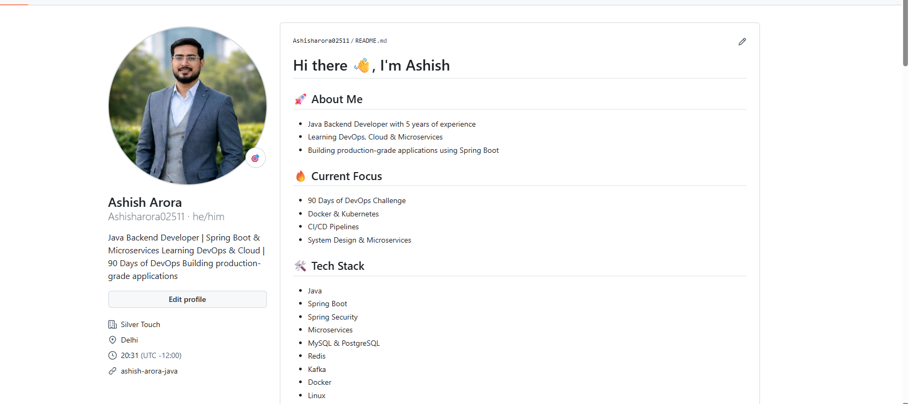

# Day 27 - GitHub Profile Makeover

## Profile Audit

### Before Improvements
- Bio was incomplete
- Repositories lacked descriptions
- Pinned repositories were not organized

## Changes Made

### Profile Updates
- Added professional bio
- Updated profile README
- Added LinkedIn and contact details

### Repository Improvements
- Organized repositories by topic
- Added README files
- Added .gitignore files
- Updated repository descriptions

### Security Cleanup
- Checked for secrets and sensitive files
- Removed unnecessary repositories

## Before Screenshot

## After Screenshot

## 3 Improvements I Made

1. Improved repository organization
Reason: Makes profile easier for recruiters to understand.

2. Added proper README files
Reason: Helps others understand project purpose quickly.

3. Updated GitHub profile branding
Reason: Creates a professional developer identity.