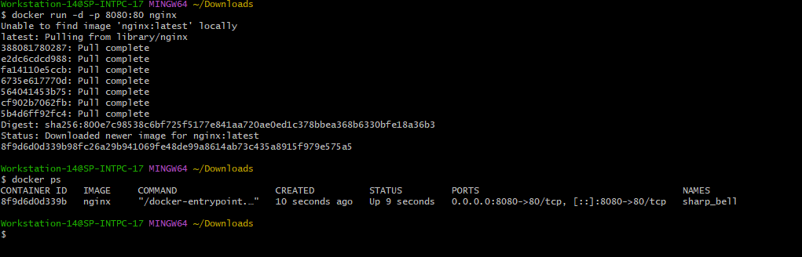
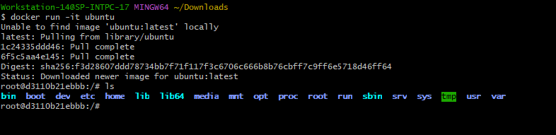
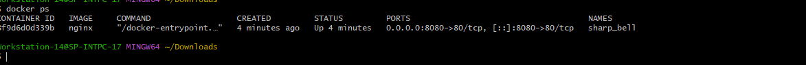
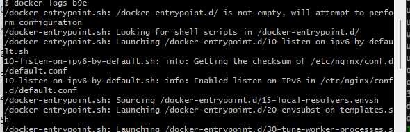

# Task - Introduction to Docker
Today task to learn basic of docker understanding

### Task 1: What is Docker?
 - What is a container and why do we need them?
 - A container is an isolated process running on your OS. It has its own filesystem, network, and process space — but shares the host OS kernel.
 - Containers vs Virtual Machines — what's the real difference?
 - Each VM carries its own FULL operating system
 - Containers share the host OS kernel — only the app is isolated
 - VMs are heavy because every single VM boots a full OS. That's why they take minutes to start and use GBs of RAM just for the OS itself.
 - Containers share the HOST kernel. They don't need their own OS. That's why they start in milliseconds and use megabytes, not gigabytes.
 - What is the Docker architecture? (daemon, client, images, containers, registry)
 - Docker Client: That's YOUR terminal. When you type `docker run nginx`, you're using the client. It's just a CLI that sends your instructions to the daemon.
 - Docker Daemon (dockerd): The background service doing ALL the real work. Building images, running containers, managing networks. Think of it as the brain. It listens for client commands.
 - Docker Image : A read-only template/blueprint. Contains the OS layer, app files, dependencies. Created from a Dockerfile. Stored locally or in a registry.
 - Docker Container :A running instance of an image. Writable, live, isolated. When you stop it, the image is unchanged. Like a running program vs its source code.
 - Docker Registry: A storage and distribution system for images. Docker Hub is the default public registry. Companies run private registries (ECR, GCR). `docker pull` downloads from here.
 - ### Task 2: Install Docker
  -  Install Docker on your machine
  -  i install on window machine for using offical website of `https://www.docker.com/products/docker-desktop`
  - verify installtion : docker --version
  - run hello-container: docker run hello-world
  -  
  docker run -it ubuntu
  sudo apt update
  sudo systemctl status docker
  sudo systemctl start docker
  sudo usermod -aG docker $USER
  newgrp docker

- ### Task 3: Run Real Containers
 1. Run Nginx Container
  ```bash  docker run -d -p 8080:80 nginx```
  
 2. Run an Ubuntu container in interactive mode: docker run -it ubuntu
 
 3. List all running containers: docker ps
 
 4. List all containers (including stopped ones): docker ps -a

 5. Stop and remove a container: docker stop && docker rm
### Task 4: Explore
1. Run a container in detached mode : detach mode run containers in background mode

2. Give a container a custom name : docker run -d --name web httpd
3. Map a port from the container to your host: docker run -d --name web2 -p 80:80 nginx <host_port>:<container_port>
4. Check logs of a running container: docker logs

5. Run a command inside a running container : docker exec -it
 


