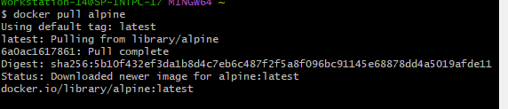
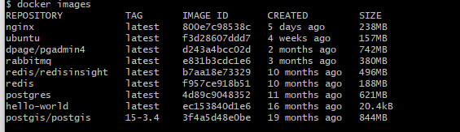
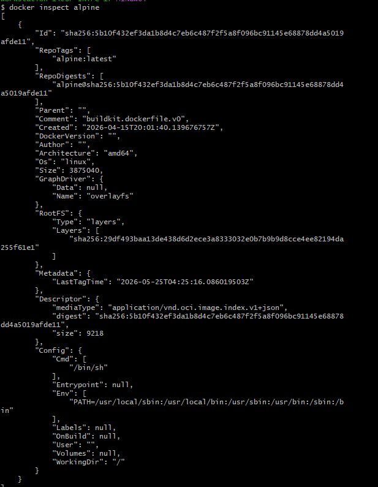
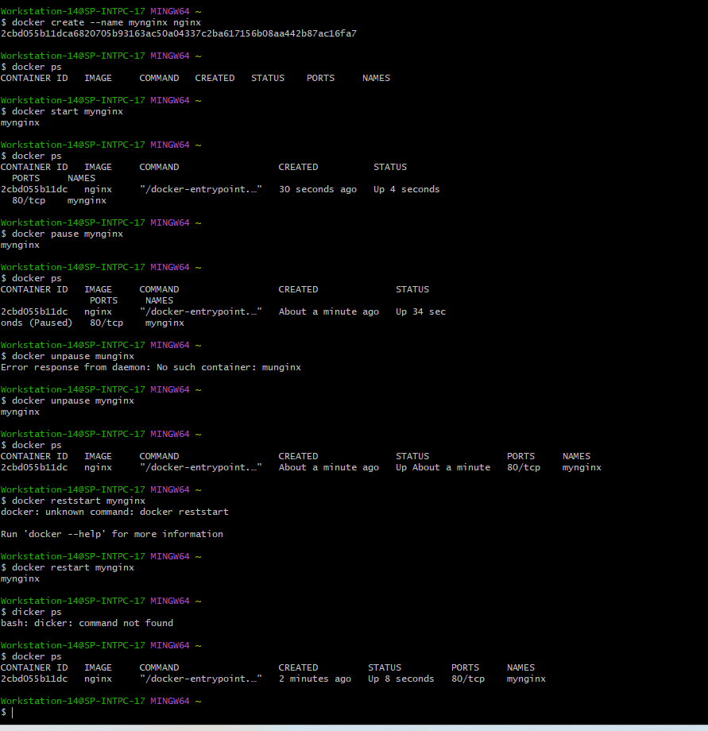
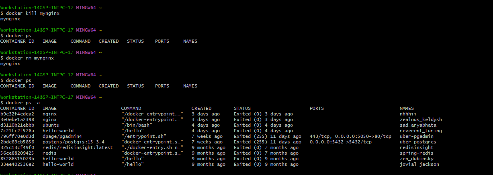
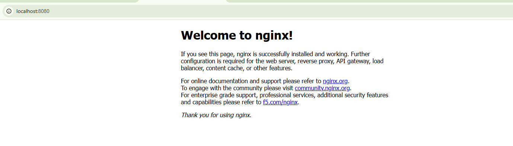
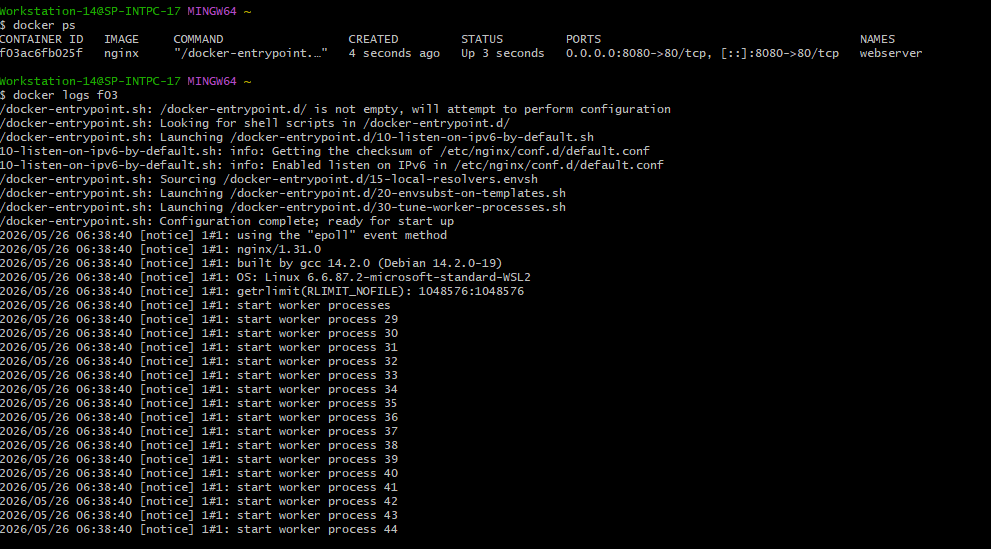
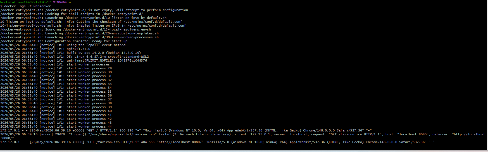

# Day 30 – Docker Images & Container Lifecycle

## Task
Today's goal is to **understand how images and containers actually work**.
### Task 1: Docker Images

1. Pull the `nginx`, `ubuntu`, and `alpine` images from Docker Hub

2. List all images on your machine — note the sizes

3. Compare `ubuntu` vs `alpine` — why is one much smaller?
4. Inspect an image — what information can you see?

5. Remove an image you no longer need
    - ```bash docker rmi <image name >```
### Task 2: Image Layers
- 
- docker history 
- Each row equal to one layer
- What are Layers?
- Docker images are built layer-by-layer.
- Docker uses layers because:
    - Reuse existing layers
    - Faster builds
    - Save storage
    - Efficient caching
- Why Some Layers Show 0B?
    - Metadata changes only
    - No filesystem changes
### Task 3: Container Lifecycle 

 -  Step 1: Create Container Only
    ```bash docker create --name mynginx nginx```
 - Step 2: Start Container
   ```bash docker start mynginx```
 - Step 3: Pause Container
   ```bash  docker pause mynginx ```
 -  Step 4: Unpause
   ```bash docker unpause mynginx ```
 - Step 5: Stop
   ```bash docker stop mynginx ```
 - Step 6: Restart
    ```bash docker restart nginx```
 - Step 7: Kill
   ```bash docker kill nginx```
 - Step 8: Remove Container
    ```bash  docker rm mynginx```
  - 
TASK 4 — Working with Running Containers
- Step 1: Run Nginx Detached
  ```bash docker run -d --name webserver -p 8080:80 nginx ```
- Step 2: Open in Browser
  - http://localhost:8080
  
- Step 3: View Logs
   ```bash  docker logs webserver```
   
- Step 4: Real-time Logs
   ```bash docker logs -f webserver ```
   
- Step 5: Enter Container
 ```bash docker exec -it webserver sh ```
- Step 6: Run Single Command
   ```bash docker exec webserver ls / ```
- Step 7: Inspect Container
   ```bash  docker inspect webserver ```
### Task 5: Cleanup
- Stop all running containers in one command
  ```bash   docker stop $(docker ps -q) ```
- Remove all stopped containers in one command
  ```bash  docker rm $(docker ps -aq) ```
- Remove unused images


 