# Day 31 – Dockerfile: Build Your Own Images

## Task
Today's goal is to **write Dockerfiles and build custom images**.
This is the skill that separates someone who uses Docker from someone who actually ships with Docker.

## Challenge Tasks
Up to Day 30, we were using images created by other people.

From Day 31 onwards, you'll create your own images.

### Task 1: Your First Dockerfile
- Step 1: Create directory
- Step 2: Create Dockerfile with no extension.
- Step 3: Add content
```dockerfile 
        FROM ubuntu
        RUN apt-get update && \
         apt-get install -y curl
        CMD ["echo","Hello from my custom image!"]
```
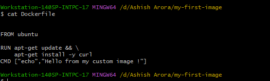
   -  FROM: Base image.Everything starts from a base image.
   - RUN:  Executed while building image.Not when container starts.
   - CMD: Runs when container starts.
- Step 4: Build Image
```dockerfile   docker build -t mu-ubunt:v1 ```
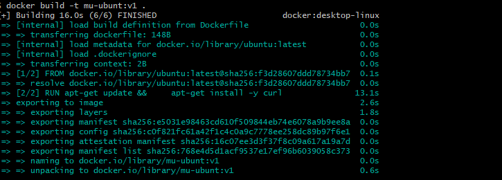
- Step 5: Verify image
```dockerfile  docker images```
- Run Container
```dockerfile  docker run ```
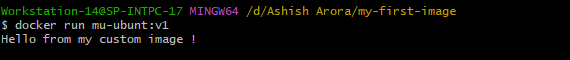
### Task 2: Dockerfile Instructions
Now let's learn the six most used instructions.
- FROM ```le  FROM nginx:alpine```  Uses lightweight Nginx image based on Alpine Linux.
- WORKDIR /app Sets /app as dockerfiworking directory inside container.
- COPY . . Copies everything from your my-first-image folder into /app inside container.
- RUN pip install -r requirements.txt Installs all Python dependencies.
- EXPOSE 5000 Documents that container uses port 5000.
- CMD ["python","app.py"] Runs Python app when container starts.
### Task 3: CMD vs ENTRYPOINT
- Create an image with CMD ["echo", "hello"] — run it, then run it with a custom command. What happens?
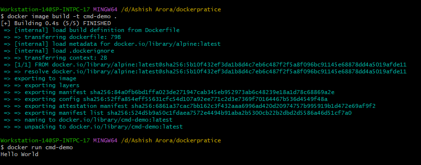
- Run without arguments: The container runs the default command echo hello and outputs
- it will given default result in our case given hello world
- Run with a custom command: When you run the container with a custom command (e.g., echo "custom command"), the custom command completely overrides the   CMD, so the output is:
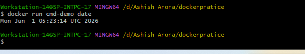
- Use CMD when: User may want to override command.
- Create an image with ENTRYPOINT ["echo"] — run it, then run it with additional arguments. What happens?
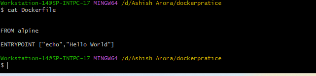
- it will given the blank result.
- Run with additional arguments: When you pass arguments (e.g., hello-world), they are appended to the ENTRYPOINT, so it runs echo hello-world
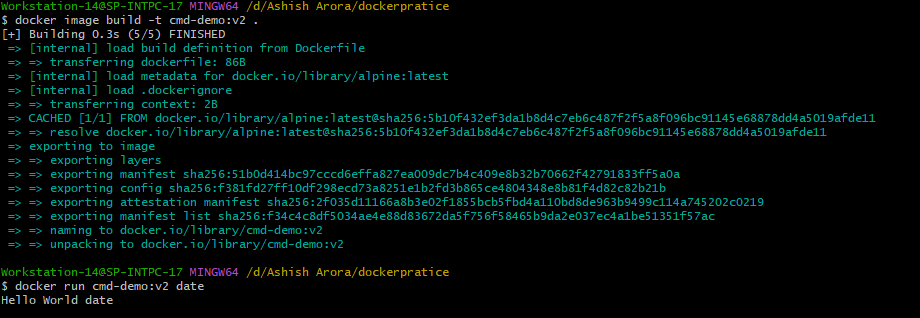
- it will append the command to the entrypoint.
- Use ENTRYPOINT when: Container should always run a specific executable.
### Task 4: Build a Simple Web App Image
1. Create a small static HTML file (index.html) with any content
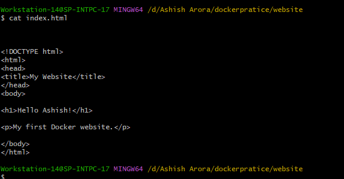
2. Write a Dockerfile with alpine base image 
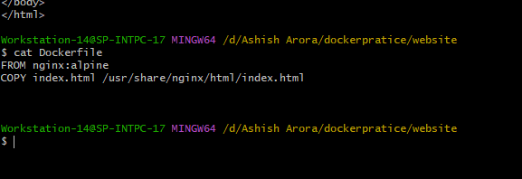
3. Build and tag it my-website:v1
4. Run it with port mapping and access it in your browser
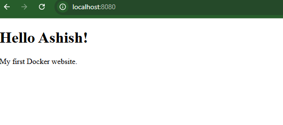
### Task 5: .dockerignore
1. By default docker copy all current project data include files like .env node_modeuls etc
 - to check that we create a Dockerfile with ls cmd and show 
 - build and run image without .docekerignore 
 - check that all files are avilable inside app 
 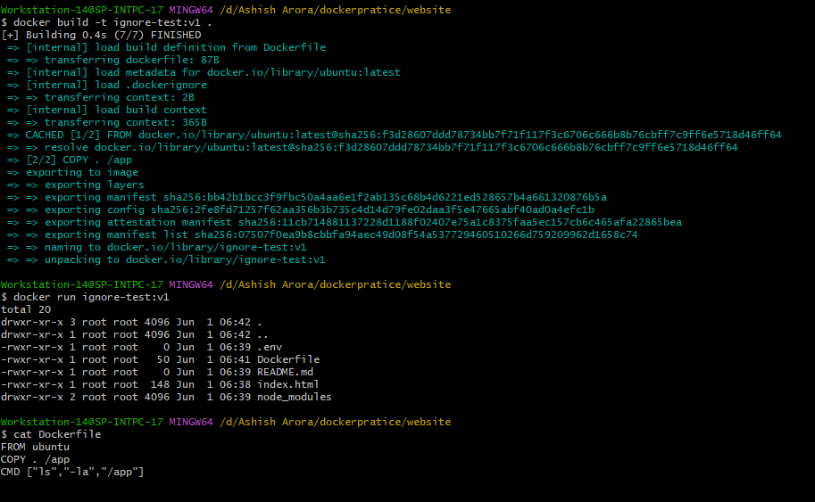
2. Now we add .dockerignore file to not to add that files .
3. chekc that these files are ignored by docker.
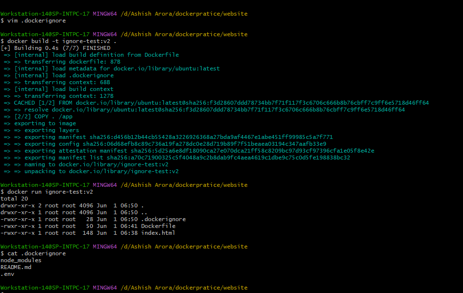

## Task 6: Build Optimization

### Bad Dockerfile

```dockerfile
FROM ubuntu

COPY . .

RUN apt-get update

RUN apt-get install -y curl

CMD ["cat","app.txt"]
```

### Observation

After modifying `app.txt`, Docker rebuilt:

- COPY layer
- apt-get update layer
- curl installation layer

Reason:
A change in the COPY layer invalidated all subsequent layers.

---

### Good Dockerfile

```dockerfile
FROM ubuntu

RUN apt-get update

RUN apt-get install -y curl

COPY . .

CMD ["cat","app.txt"]
```

### Observation

After modifying `app.txt`, Docker reused cached layers for:

- apt-get update
- curl installation

Only the COPY layer and layers after it were rebuilt.

---

### Why Layer Order Matters

Docker caches layers sequentially.

If a frequently changing instruction appears early in the Dockerfile, all following layers must rebuild.

Therefore:

- Frequently changing instructions should be placed near the end.
- Expensive instructions should be placed near the beginning.

This improves build speed significantly.
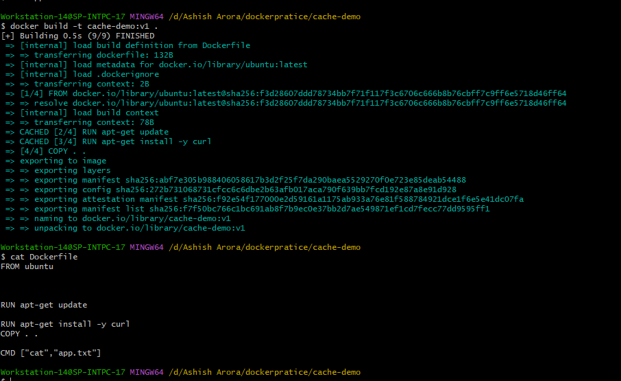
