# Day 32 – Docker Volumes & Networking

## Challenge Tasks

### Task 1: The Problem(Without Volume)
 - Step 1: Run PostgreSQL
 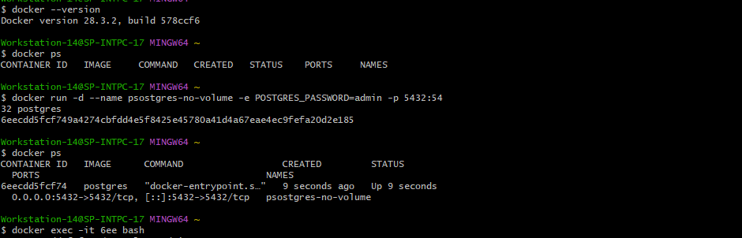
 - Step 2: Enter Container
 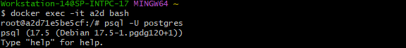
 - Step 3: Create Table
 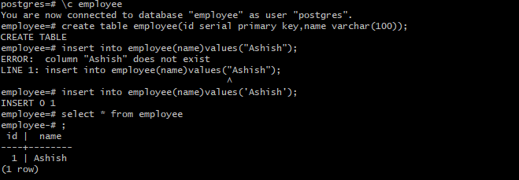
 - Step 4: Exit
 - Step 5: Remove Container
 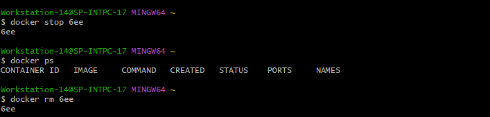
 - Step 6: Start New Container
 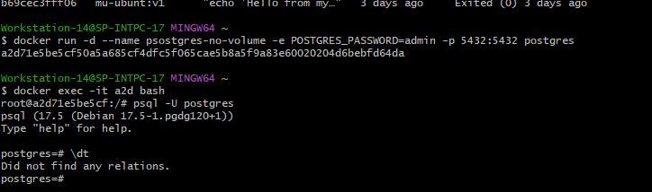
 - Observation: What happened: our table disappeared.
 - Why: Container filesystem is stored inside the container.When container is removed data also.
### Task 2: Named Volumes
 - Step 1: Create Volume: ```dockerfile docker volume create postgres-data```
 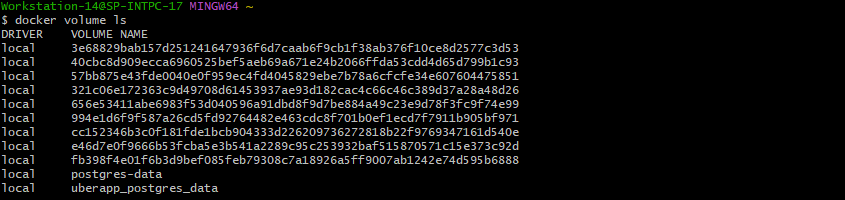
 - Step 2: Run PostgreSQL With Volume
 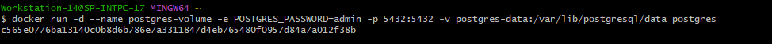
 - Step 3: Create Data
 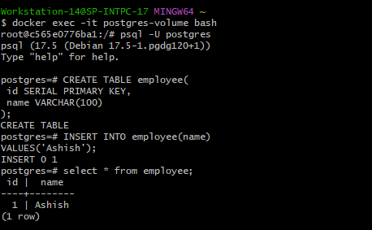
 - Step 4: Remove Container
 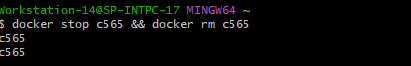
 - Step 5: Start New Container Using Same Volume
 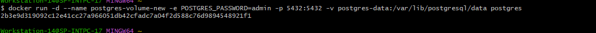
 - Step 6: Verify Data
 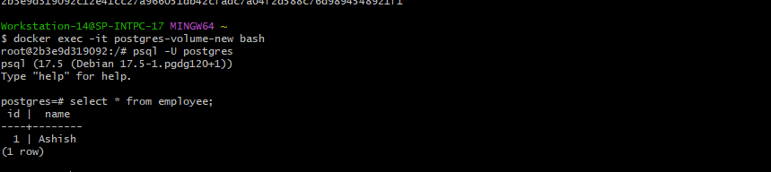
### Task 3: Bind Mounts
- Step 1: Create a folder.
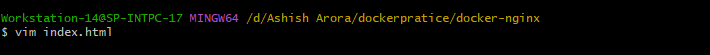
- Step 2: Run an Nginx container and bind mount your folder to the Nginx web directory.
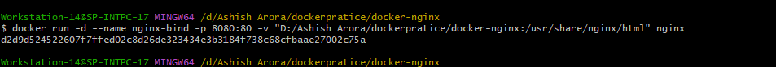
- Step 3: Access the page in your browser.

- Step 4: Edit the index.html on your host — refresh the browser.
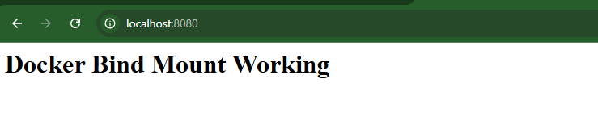
### Task 4: Docker Networking Basics
- Step 1: List all Docker networks on your machine ```dockerfile docker network ls```
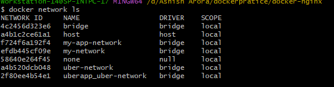
- Step 2: Inspect the default bridge network
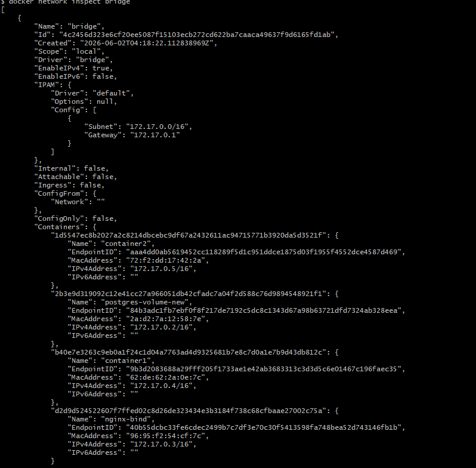
- Step 3: Run two containers on the default bridge — can they ping each other by name?No
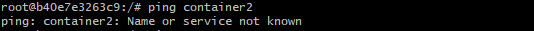
- Step 4: Run two containers on the default bridge — can they ping each other by IP?YES
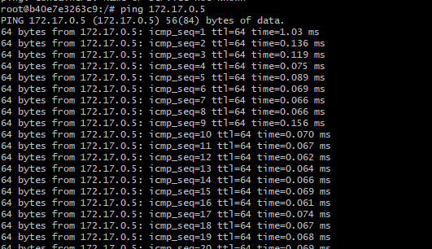
### Task 5: Custom Networks
- Create a custom bridge network called my-app-net
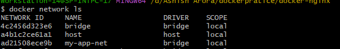
- Run two containers on my-app-net
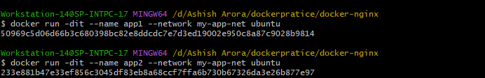
- Ping by name : Why Does This Work?Custom bridge network creates:Docker DNS Servers Docker automatically maintain ip
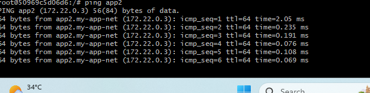
### Task 6: Put It Together
 - Step 1: Create a custom network
 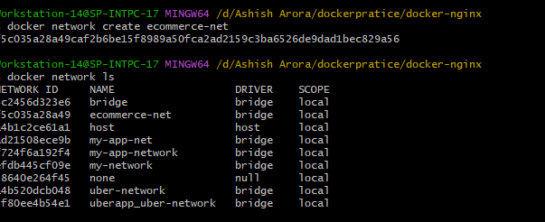
 - Step 2: Run database container on that network with volume .
 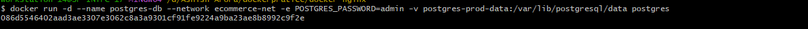
 - Step 3: Run app on that same network 
 - Step 4: Ping to check the database 
 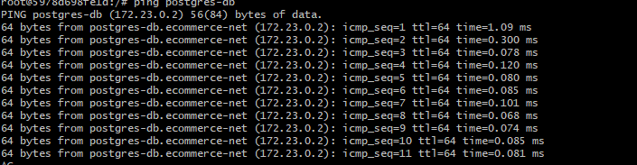

