# Day 33 – Docker Compose: Multi-Container Basics
## Task
Today's goal is to **run multi-container applications with a single command**.
Yesterday you manually created networks and volumes and ran containers one by one. Docker Compose does all of that in one YAML file.

## Challenge Tasks

### Task 1: Install & Verify
- Command to check: ```dockerfile  docker compose version ```
-  if not then install: ```dockerfile  sudo apt update sudo apt install docker-compose-plugin```
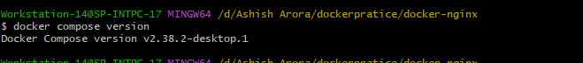
### Task 2: First Compose File
- Step 1: create folder
- Step 2: Create file 
- Step 3: Start it with ```dockefile docker compose up -d ```
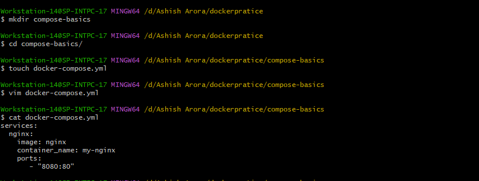
- Step 4: Access it from browser
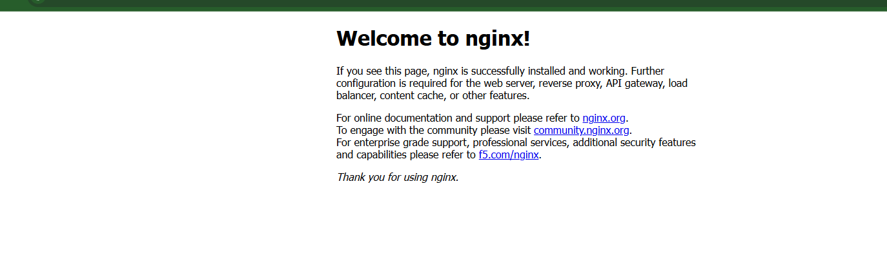
- Step 5: Stop it with ```dockerfile docker compose down```
### Task 3: Two-Container Setup
-  Step 1: Write a compose file where we write mysql conatiner and wordpress container yml
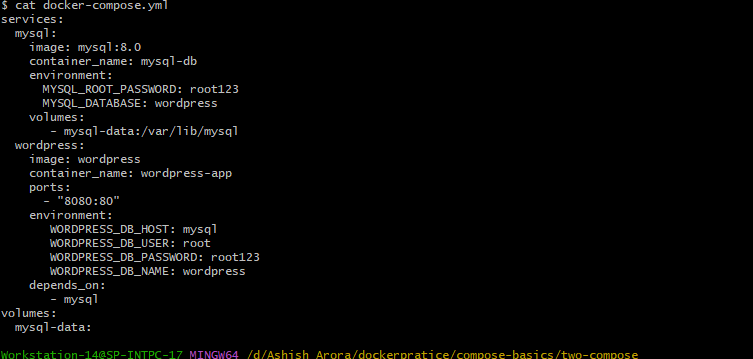
-  Step 2: Run the container using  docker compose file```dockerfile docker compose up -d ```
-  Step 3: Acces world press on the browser and create our account
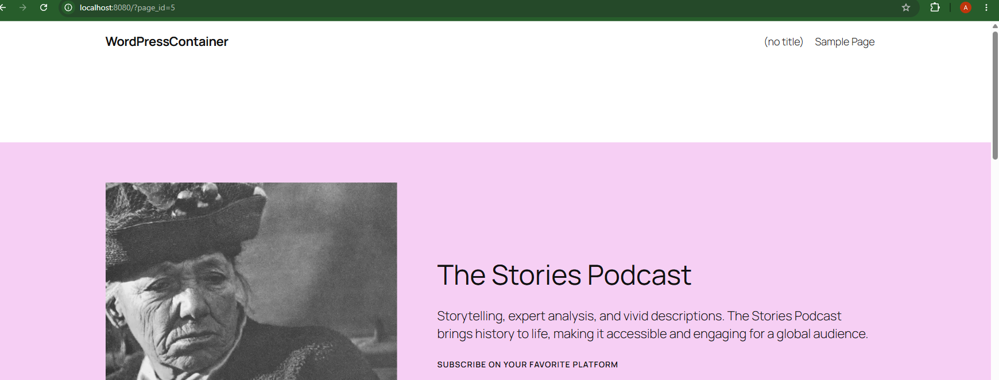
-  Step 4: Down our container by using ```dockerfile  docker compose down```
-  Step 5: Again up our container add verify that your data still there.
    -  yoour data is still there 
### Task 4: Compose Commands
- Detached Mode: container runs into background ```dockerfile  docker compose up -d ```
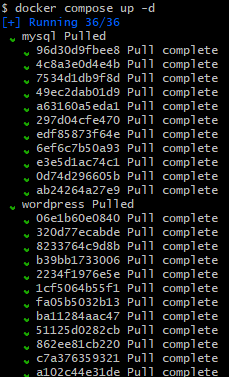
- Running Services: check how many services are running ```dockerfile docker compose ps```
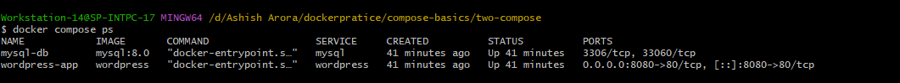
- LogsofAllServices: check logs of all service  ```dockerfile  docker compose logs```
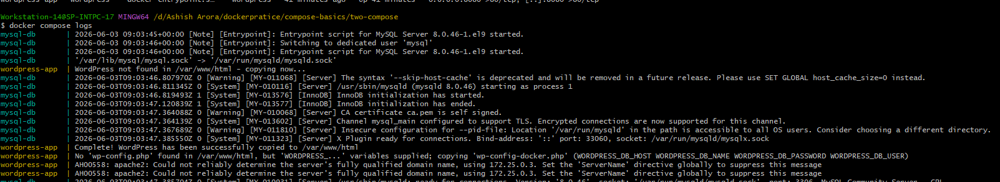
- LOgsOfSpecificService:  if you want to check specific service logs ```dockerfile docker compose logs mysql ```
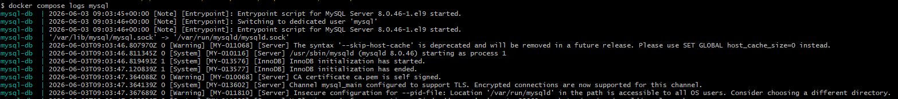
- Stop Without Removing: want to stop container ```dockerfile docker compose stop```
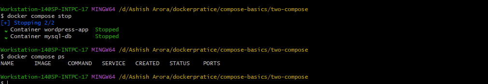
- Start Again: again want start a container use this ```dockerfile docker compose start``` 
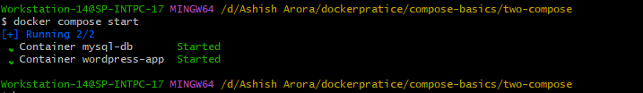
- RemoveEverything: its remove containers and networks keeps volume ```dockerfile docker compose down ```
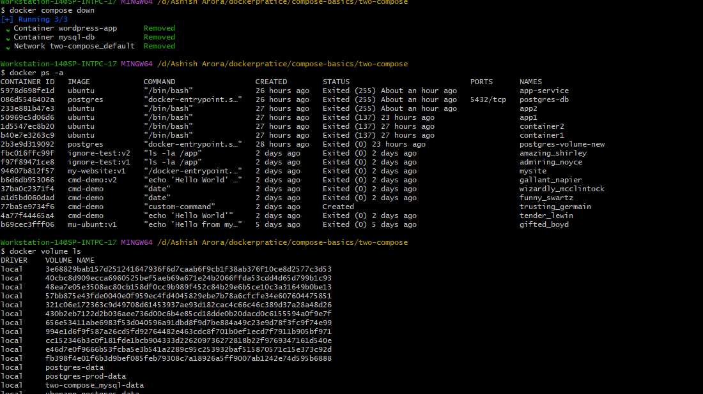
- RemoveVolume: its remove volume also ```dockerfile docker compose down -v```
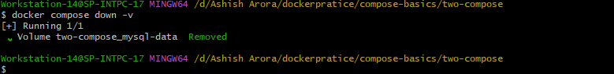
- Rebuild: you chnaged docker file rebuild images using ```dockerfile  docker compose up --build```
### Task 5: Environment Variables
 - Create a .env file and reference variables from it in your compose file
 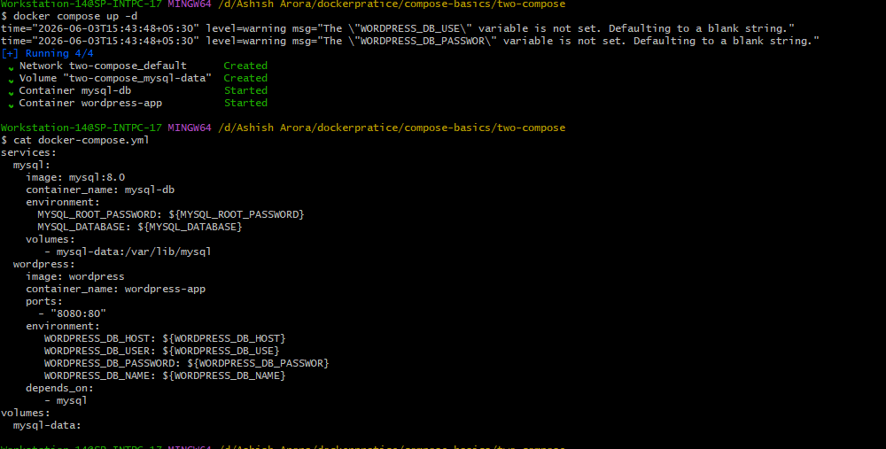
