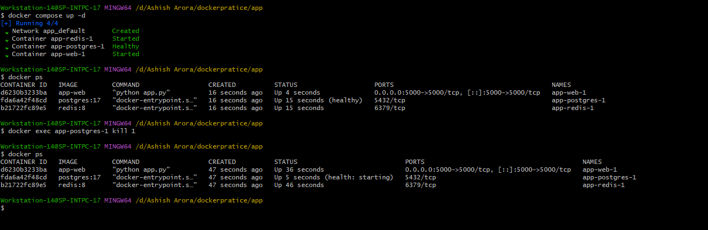
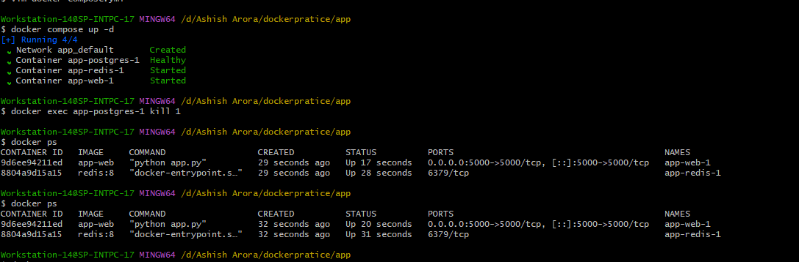
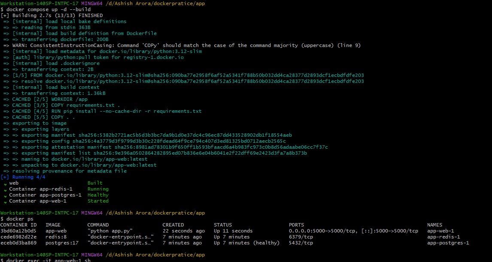

# Day 34 – Docker Compose: Real-World Multi-Container Apps
## Task
Today's goal is to **build more complex, production-like setups with Docker Compose**.

Yesterday was basics. Today you handle real scenarios — app + database + cache, healthchecks, restart policies, and service dependencies.

### Task 1: Build Your Own App Stack
- Create a `docker-compose.yml` for a 3-service stack:
- [Code](project)

### Task 2: depends_on & Healthchecks
- Postgres container starts first.
- Healthcheck waits until DB is ready.
- App container starts only after DB is healthy.

### Task 3: Restart Policies
- Why?: conatiner crashes should it come back automatically
-  without restart policy: container crashes ,container dead application unavilable.
- policy restart: always maeans crash? restart  ,server reboot restart.

-  restart: on-failure means  Restart only if container exits with non-zero code.
 
### Task 4: Custom Dockerfiles in Compose
- chnage into you html or any file build your image and check new version show 

### Task 5 — Networks & Volumes
- Production systems NEVER rely entirely on defaults.
- Named Network
- Named Volume
- Labels