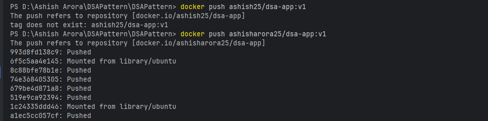
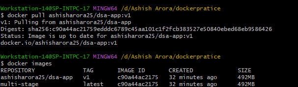
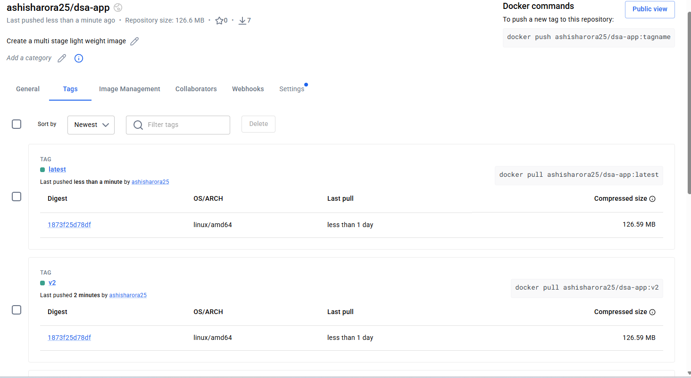
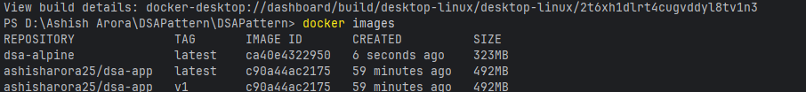

# Day 35 – Multi-Stage Builds & Docker Hub
## Task
Today's goal is to **build optimized images and share them with the world**.
Multi-stage builds are how real teams ship small, secure images. Docker Hub is how you distribute them. Both are interview favourites.
## Challenge Tasks
### Task 1: The Problem with Large Images
1. i create a java project write docker file 
2. Create a Dockerfile that builds and runs it in a **single stage**
3. Build the image and check its **size**

### Observation: 
- we observe that the file size is to larage.
.png)
[Dockerfile](Project/DSAPattern/Dockerfile)
### Task 2: Multi-Stage Build
1. Rewrite the Dockerfile using **multi-stage build**:
   - Stage 1: Build the app (install dependencies, compile)
   - Stage 2: Copy only the built artifact into a minimal base image (`alpine`, `distroless`, or `scratch`)
2. Build the image and check its size again
3. Compare the two sizes
.png)
[text](Project/DSAPattern/Dockerfile.final)
Why Smaller: Because final image contains JRE+Jar
### Task 3: Push to Docker Hub
1. Create a free account on [Docker Hub](https://hub.docker.com) (if you don't have one)
2. Log in from your terminal
3. Tag your image properly: `yourusername/image-name:tag`
4. Push it to Docker Hub
5. Pull it on a different machine (or after removing locally) to verify

### Task 4: Docker Hub Repository
1. Go to Docker Hub and check your pushed image
2. Add a **description** to the repository
3. Explore the **tags** tab — understand how versioning works
4. Pull a specific tag vs `latest` — what happens?
Pull a specific tag vs latest — what happens?
Specific tag = pulls that exact version of the image.
latest = pulls whatever image is currently marked latest.

### Task 5: Image Best Practices
Apply these to one of your images and rebuild:
1. Use a **minimal base image** (alpine vs ubuntu — compare sizes)
2. **Don't run as root** — add a non-root USER in your Dockerfile
3. Combine `RUN` commands to **reduce layers**
4. Use **specific tags** for base images (not `latest`)

Check the size before and after.
[text](Project/DSAPattern/Dockerfile.alpine)
- Why Alpine:Alpine Linux is a minimal Linux distribution used to create smaller Docker images. Smaller images reduce storage usage, network transfer time, and deployment time.
- Why Non-Root User:Running containers as a non-root user improves security by limiting the permissions available to the application.
- Why Specific Tags:Specific tags provide predictable and repeatable builds. Using latest can introduce unexpected changes.

