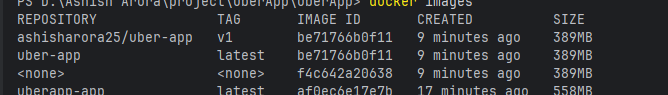
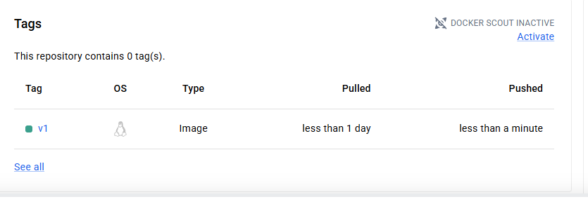
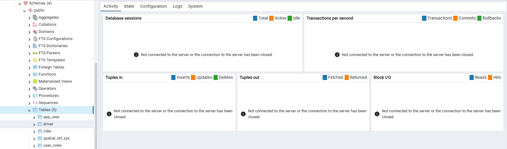

# Day 36 – Docker Project: Dockerize a Full Application

## Task
Today's goal is to **take a real application and Dockerize it end-to-end**.

No tutorials. No hand-holding. Pick an app, write the Dockerfile, set up Compose, and ship it. This is what you'll do on the job.
## Challenge Tasks

### Task 1: Pick Your App
 - craete a java application using spring boot
 - This application create data table in postgres
 - Here is docker file of this application
 - [Dockerfile](Project/uberApp/Dockerfile)

 ### Task 2: Write the Dockerfile
- dockerfile with alpine version reduce size.
- copy onlu src and jar 
-  use multistage.
- [Dockerfile](Project/uberApp/Dockerfile)

### Task 3: Add Docker Compose+
- Run `docker compose up` and verify everything works together.
- [docker-compose.yml](Project/uberApp/docker-compose.yml)

### Task 4: Ship It

--

### Task 5: Test the Whole Flow
1. Remove all local images and containers
2. Pull from Docker Hub and run using only your compose file
3. Does it work fresh? If not — fix it until it does
- Yes it work fresh

    [Working App](app/app.png)

