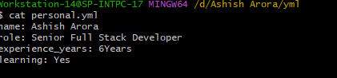
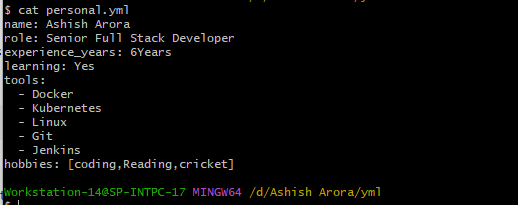
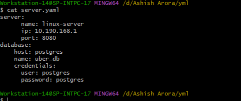
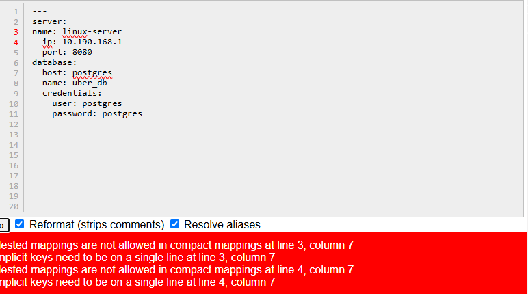
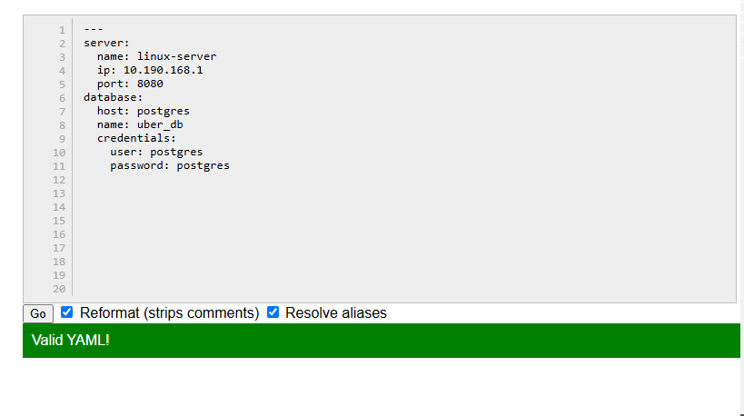

# Day 38 – YAML Basics
## Task
Before writing a single CI/CD pipeline, you need to get comfortable with **YAML** — the language every pipeline is written in.

You will:
- Understand YAML syntax and rules
- Write YAML files by hand
- Validate them
## Challenge Tasks
### Task 1: Key-Value Pairs
-  create a `personal.yml` and wirte down my professional details
-  
### Task 2: Lists
 - Here we understand how we write list data into yml
 - 
### Task 3: Nested Objects
- Why Indentation Important: YAML doesnot have brackets so use space for parser.
- 
### Task 4: Multi-line Strings
- Two type of multi line string 
- Preserves lines(|): use pipe symbol to preserves line like block
- Greater Than (>): Convert into single line
- When Use Which?
- `|` use when writing shell scripting sql queries,config file
- `>` use when message, description.
### Task 5: Validate Your YAML
- Intentionally break the indentation 
- 
- correct error
- 
### Task 6: Spot the Difference
Read both blocks and write what's wrong with the second one:
- Problem: List indentation inconsistent.
- Always use same indentation level.