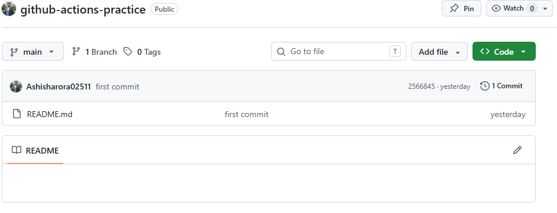
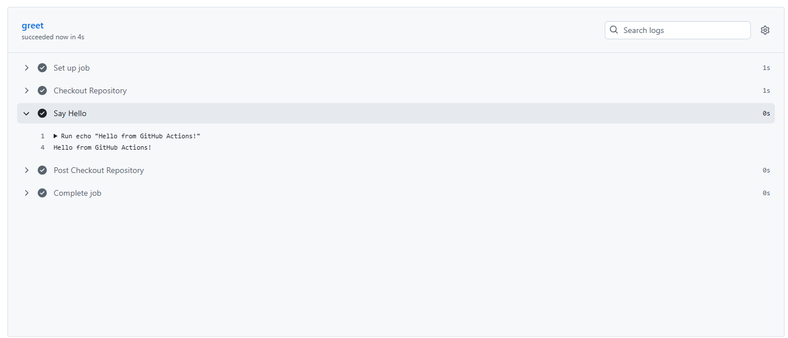
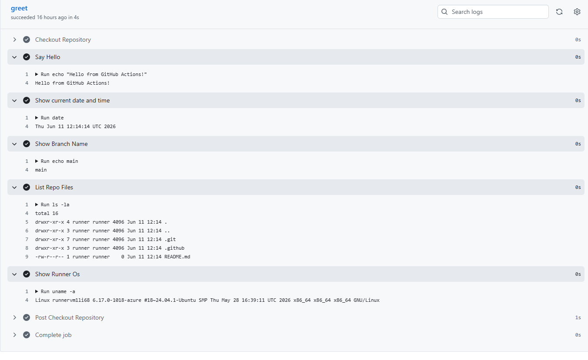
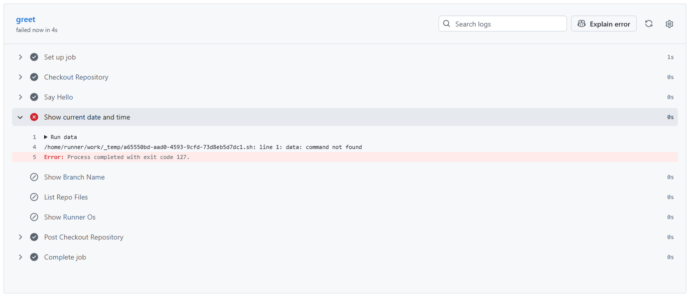
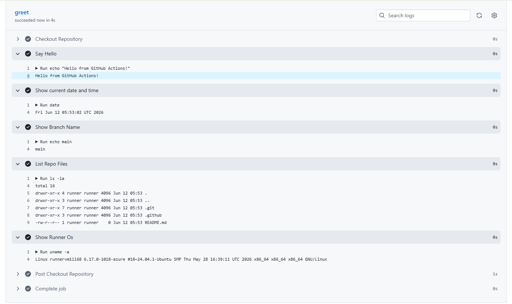

# Day 40 – Your First GitHub Actions Workflow

## Task
Today you write your **first GitHub Actions pipeline** and watch it run in the cloud.
This is the moment CI/CD stops being a concept and becomes real.
## Challenge Tasks

### Task 1: Set Up
1. Created a public GitHub repository named:github-actions-practice
2. Cloned it locally:
3. Created GitHub Actions workflow directory:

### Task 2: Create My First Workflow
1. Triggers on every `push`
2. Has one job called `greet`
3. Runs on `ubuntu-latest`
4. Has two steps:
   - Step 1: Check out the code using `actions/checkout`
   - Step 2: Print `Hello from GitHub Actions!`
5. yes its green and runiing on push

### Task 3: Understand the Anatomy
- name: Defines the workflow name displayed in the GitHub Actions tab.
- on: Defines when the workflow should run.
- jobs: Contains one or more jobs executed by GitHub Actions.
- runs-on: Specifies the operating system used by the GitHub runner.
- steps: Contains the tasks executed one by one inside a job.
- uses: Uses an existing GitHub Action.
- run: Executes shell commands.
### Task 4: Add More Steps
1. Print the current date and time
2. Print the name of the branch that triggered the run (hint: GitHub provides this as a variable)
3. List the files in the repo
4. Print the runner's operating system

### Task 5: Break It On Purpose
- intentionally breking the pipeline with wrong command
- 
- fix error 
- 
- What happens?
- GitHub Actions page becomes red.
- All shows exactly like this .
- Compile Error
- Test Failure
- Docker Build Failure
- Deployment Failure
